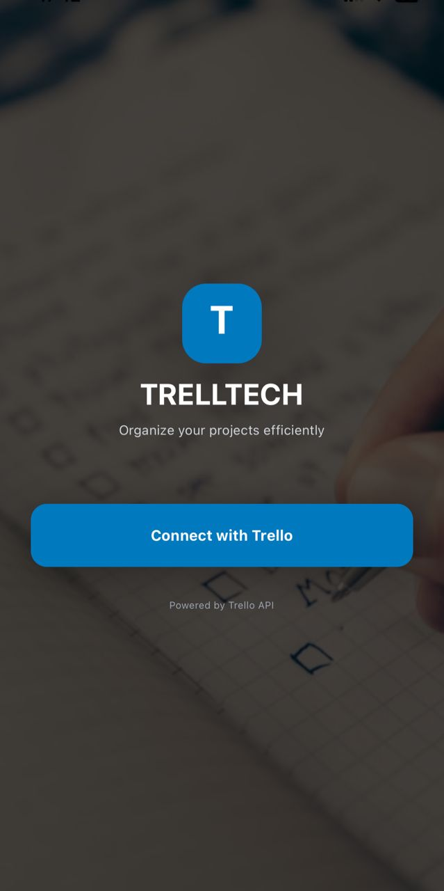
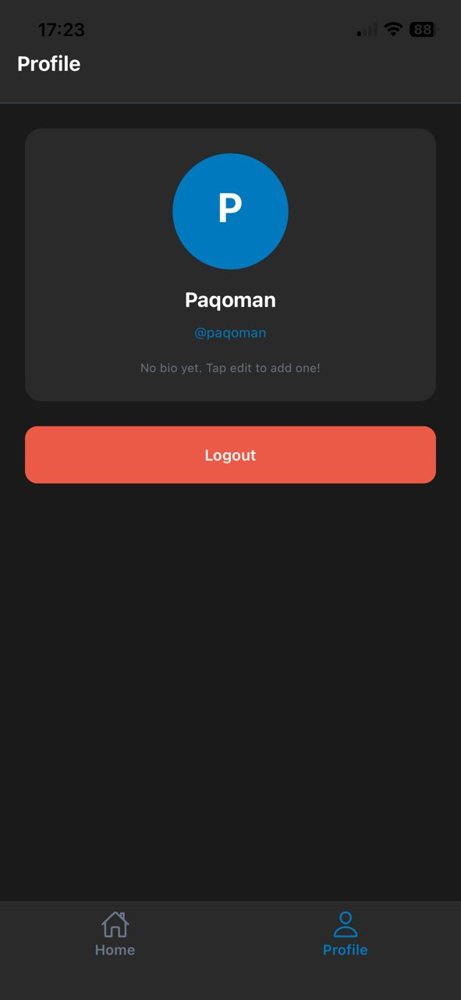
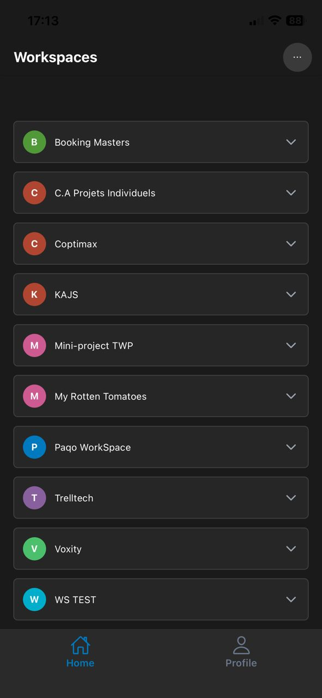
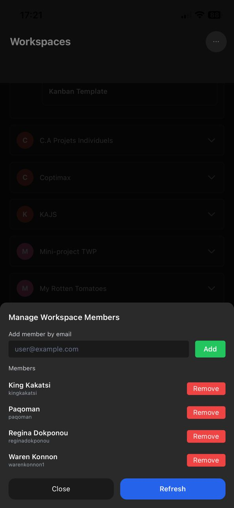
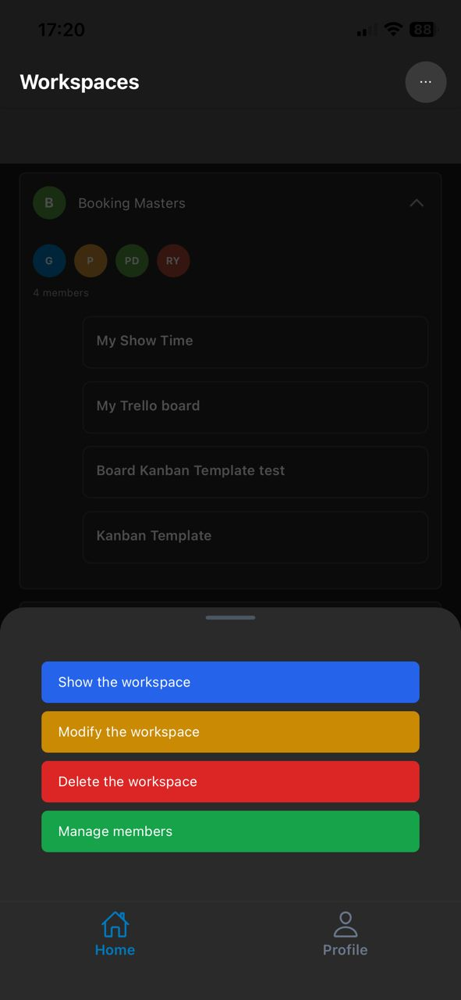
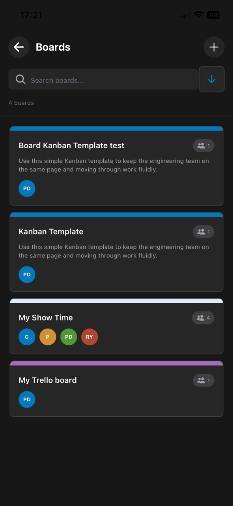
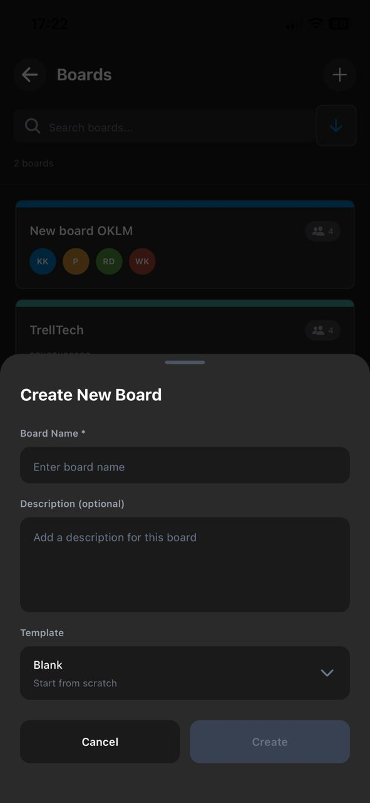
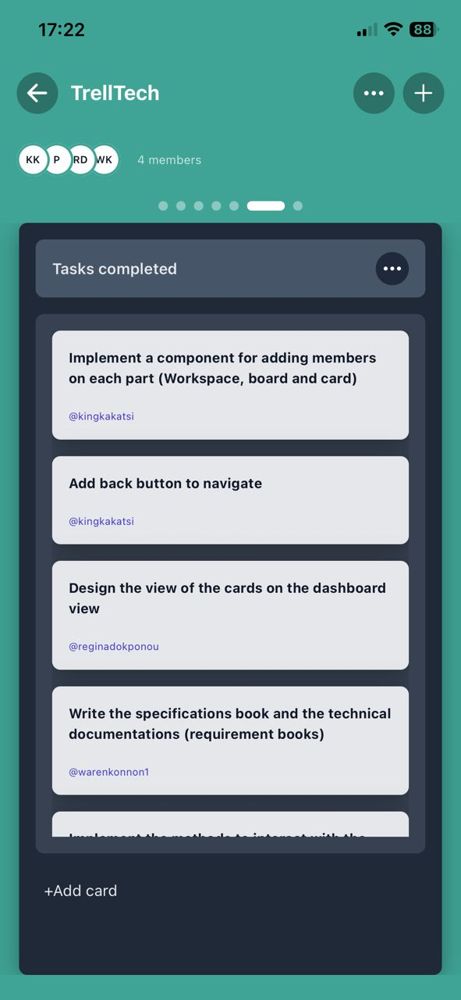
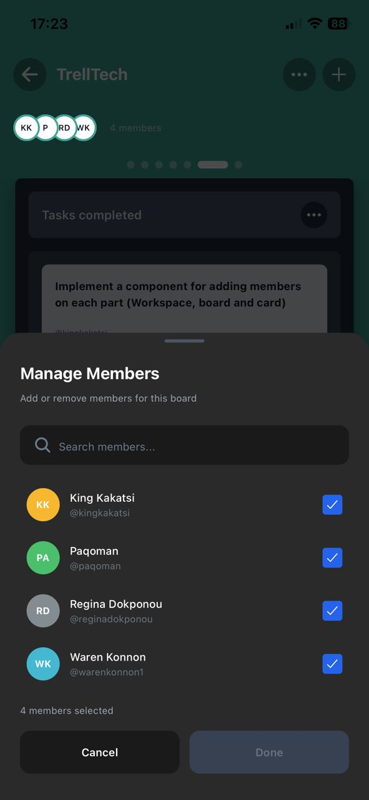

# TrellTech

**TrellTech** is a native mobile project management application for iOS and Android that integrates seamlessly with Trello's API. Built with React Native and Expo Router, TrellTech provides a modern, intuitive interface for managing your Trello workspaces, boards, lists, and cards on the go.

## Overview

TrellTech transforms your mobile device into a powerful project management tool by connecting directly to your Trello account. Whether you're organizing personal projects or collaborating with teams, TrellTech delivers a native mobile experience optimized for touch interactions and mobile workflows.

### Why TrellTech?

- **Native Performance**: Built with React Native for smooth, native app performance
- **Full Trello Integration**: Complete access to your Trello workspaces and boards
- **Kanban Carousel**: Innovative horizontal swipe navigation between columns
- **Mobile-Optimized**: Designed specifically for mobile touch interactions
- **Dark Mode**: Modern dark interface for comfortable viewing
- **Offline-Ready**: AsyncStorage for local data caching
- **Cross-Platform**: Single codebase for both iOS and Android

## Key Features

### Workspace Management
- Create, update, and delete workspaces
- View all your Trello workspaces in one place
- Manage workspace members
- Configure workspace settings

### Board Operations
- Create boards with template selection (Kanban, etc.)
- Update board details and settings
- Delete boards with confirmation
- View all boards within a workspace

### List Management (Kanban Columns)
- Create and organize lists
- Update list names and positions
- Delete lists
- Horizontal carousel navigation

### Card Operations
- Create cards with detailed information
- Update card details and descriptions
- Delete cards
- Assign team members to cards
- Add and view comments
- Move cards between lists

## Screenshots

### Login page


### User connexion to trello app


### User profile


### Home & Workspaces


### Management of workspace members 


### Action on workspace 


### User boards


### Board creation



### User board detail



### Management of board members 



## Quick Links

- [Installation Guide](./docs/INSTALLATION.md)
- [Quick Start](./docs/QUICKSTART.md)
- [Architecture Overview](./docs/ARCHITECTURE.md)
- [API Integration](./docs/API_INTEGRATION.md)
- [Styling Guide](./docs/STYLING_GUIDE.md)
- [Development Guide](./docs/DEVELOPMENT.md)
- [Contributing](./docs/CONTRIBUTING.md)
- [Deployment](./docs/DEPLOYMENT.md)

## Technology Stack

### Frontend
- **Framework**: React Native
- **Navigation**: Expo Router (file-based routing)
- **Styling**: NativeWind (TailwindCSS for React Native)
- **Language**: JavaScript (JSX)

### State & Storage
- **State Management**: React Context API
- **Local Storage**: AsyncStorage
- **HTTP Client**: Axios

### Platform
- **Runtime**: Expo
- **Supported OS**: iOS 13+, Android 6+
- **External API**: Trello REST API v1


## Getting Started

### Prerequisites

- Node.js 18.x or higher
- npm 9.x or higher
- Expo CLI
- iOS Simulator (Mac) or Android Emulator

### Quick Start

```bash
# Clone the repository
git clone git@github.com:EpitechCodingAcademyPromo2026/C-COD-290-COT-2-1-epicture-6.git
cd trelltech

# Install dependencies
npm install

# Start development server
npx expo start

# Run on iOS simulator
npx expo start --ios

# Run on Android emulator
npx expo start --android
```

For detailed setup instructions, see [INSTALLATION.md](./docs/INSTALLATION.md)

## Team Organization

This project is designed for collaborative development with 5 team members:

### Person 1: Home & Workspaces
- Home screen with workspaces list
- Workspace API integration
- Workspace CRUD operations

### Person 2: Boards & Kanban
- Boards list screen
- Board detail with Kanban carousel
- List management

### Person 3: Cards & Details
- Card detail screen
- Comments functionality
- Member assignment

### Person 4: Settings & Members
- Workspace settings
- Member management
- Configuration screens

### Person 5: Auth & UI
- Authentication logic
- Bottom sheets for CRUD operations
- Shared UI components

## Navigation Flow

```
Login Screen
    ↓
Home (Workspaces)
    ↓
Boards List (/workspace/[id]/boards)
    ↓
Board Detail - Kanban (/workspace/[id]/board/[id])
    ↓
Card Detail (/workspace/[id]/board/[id]/card/[id])
```

## Development Workflow

### Running the App

```bash
# Start development server
npx expo start

# Open in iOS Simulator
npx expo start --ios

# Open in Android Emulator
npx expo start --android

# Open on physical device
# Scan QR code with Expo Go app
```

### Code Style

- Use NativeWind for all styling
- Follow React Native best practices
- Keep components simple and focused
- Write clear, beginner-friendly code
- Comment complex logic

### Git Workflow

```bash
# Create feature branch
git checkout -b feature/your-feature-name

# Make changes and commit
git add .
git commit -m "feat: add amazing feature"

# Push and create PR
git push origin feature/your-feature-name
```

## Configuration

### Environment Setup

Create a `constants/config.js` file:

```javascript
export const TRELLO_CONFIG = {
  API_KEY: 'your-trello-api-key',
  BASE_URL: 'https://api.trello.com/1',
};

export const COLORS = {
  primary: '#0079BF',
  danger: '#EB5A46',
  background: '#1a1a1a',
  surface: '#2a2a2a',
};
```

For detailed configuration, see [API_INTEGRATION.md](./docs/API_INTEGRATION.md)

## Testing the App

### iOS Simulator (Mac only)

```bash
npx expo start --ios
```

### Android Emulator

```bash
npx expo start --android
```

### Physical Device

1. Install Expo Go from App Store or Google Play
2. Run `npx expo start`
3. Scan QR code with Expo Go

## Common Commands

```bash
# Start development server
npx expo start

# Clear cache and restart
npx expo start -c

# Install new dependency
npm install package-name

# Update Expo SDK
npx expo install expo@latest

# Build for production
eas build --platform ios
eas build --platform android
```

## Troubleshooting

### Metro bundler issues
```bash
npx expo start -c
```

### iOS Simulator not opening
```bash
sudo xcode-select --switch /Applications/Xcode.app
```

### Android Emulator connection
```bash
adb reverse tcp:8081 tcp:8081
```

For more solutions, see [INSTALLATION.md](./docs/INSTALLATION.md#troubleshooting)

## API Integration

TrellTech uses Trello's REST API v1. To get started:

1. Create a Trello account
2. Get your API Key from [Trello Developer Portal](https://trello.com/power-ups/admin)
3. Generate a token for your application
4. Add credentials to `constants/config.js`

For detailed API setup, see [API_INTEGRATION.md](./docs/API_INTEGRATION.md)

## Styling

TrellTech uses NativeWind (TailwindCSS for React Native):

```jsx
// Example component styling
<View className="bg-gray-900 p-4 rounded-lg">
  <Text className="text-white text-xl font-bold">
    Hello TrellTech
  </Text>
</View>
```

For complete styling guide, see [STYLING_GUIDE.md](./docs/STYLING_GUIDE.md)

## Contributing

We welcome contributions! To get started:

1. Fork the repository
2. Create a feature branch
3. Make your changes
4. Submit a pull request

See [CONTRIBUTING.md](./docs/CONTRIBUTING.md) for detailed guidelines.

## Deployment

### iOS Deployment

```bash
eas build --platform ios
eas submit --platform ios
```

### Android Deployment

```bash
eas build --platform android
eas submit --platform android
```

For complete deployment guide, see [DEPLOYMENT.md](./docs/DEPLOYMENT.md)

## Architecture

TrellTech follows a clean, modular architecture:

- **Expo Router**: File-based routing system
- **Context API**: Global state management
- **Service Layer**: API and storage abstraction
- **Component Library**: Reusable UI components

For detailed architecture explanation, see [ARCHITECTURE.md](./docs/ARCHITECTURE.md)

## Resources

- [React Native Documentation](https://reactnative.dev/docs/getting-started)
- [Expo Documentation](https://docs.expo.dev/)
- [Expo Router Guide](https://docs.expo.dev/router/introduction/)
- [NativeWind Documentation](https://www.nativewind.dev/)
- [Trello API Documentation](https://developer.atlassian.com/cloud/trello/rest/)

## Support

If you encounter issues:

1. Check [INSTALLATION.md](./docs/INSTALLATION.md#troubleshooting)
2. Review [GitHub Issues](https://github.com/yourusername/trelltech/issues)
3. Contact the development team

## License

This project is licensed under the MIT License - see the [LICENSE](LICENSE) file for details.

## Authors

### Leroi Kakatsi
- **Email**: leroi.kakatsi@epitech.eu
- **WhatsApp**: +233 53 561 0908
- **Portfolio**: [kingweb.pythonanywhere.com](https://kingweb.pythonanywhere.com)

### Joel Houinsavi
- **Email:** joel.houinsavi@epitech.eu
- **WhatsApp:** +229 01 97 70 38 37
- **Portfolio:** [www.paqo.net](https://paqo.net/Auteur)

### Regina Dokponou
- **Email**: regina.dokponou@epitech.eu
- **WhatsApp**: +221 01 94 42 82 15
- **Portfolio**: [regina-dokponou.linkedin](https://www.linkedin.com/in/regina-dokponou-61a343312)

### Waren Konnon
- **Email**: waren.konnon@epitech.eu
- **WhatsApp**: +229 01 61 62 32 32
- **Portfolio**: [waren-konnon.linkedin](https://www.linkedin.com/in/waren-konnon-651095310)

## Acknowledgments

- Trello for providing the API
- Expo team for the amazing framework
- React Native community
- NativeWind for TailwindCSS integration


**Built with care by Mobomobilo team**