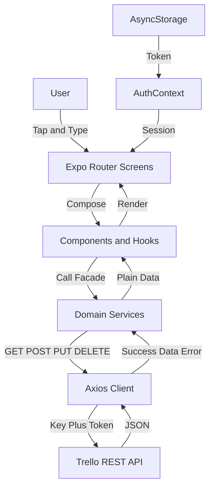
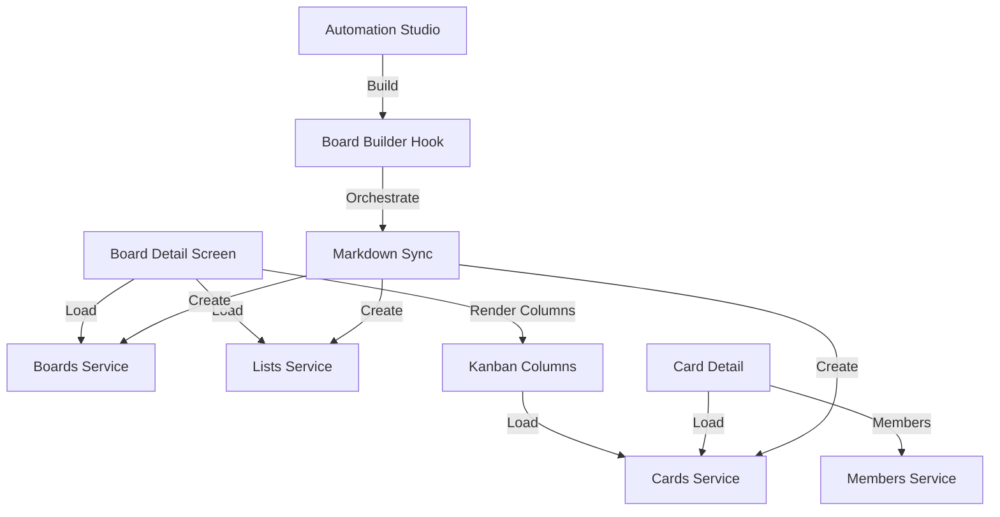
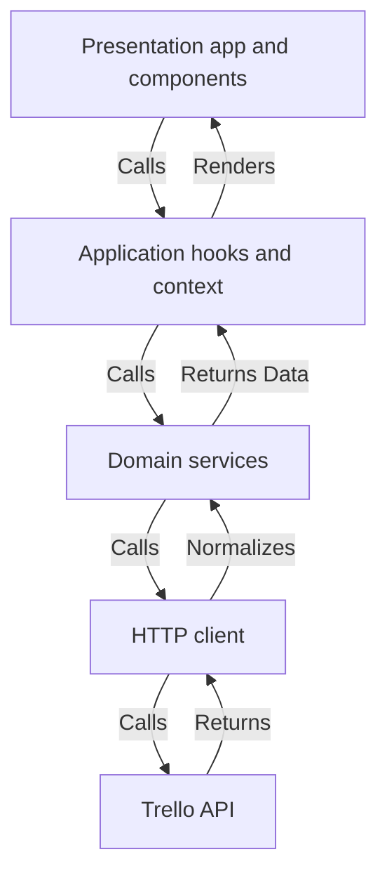

# Architecture

TrellTech is a client-only Expo mobile app. Screens call domain services, services call one authenticated axios client, and that client calls the Trello REST API. There is no custom backend.

## Project Tree

```text
trelltech/
├── app/                 # expo-router screens (presentation only)
├── components/          # reusable UI (ui, boards, cards, home, workspace, automation)
├── contexts/            # AuthContext session store
├── hooks/               # automation hooks (logs, board builder, branch tools)
├── services/            # api client + boards, lists, cards, workspaces, members, auth
├── utils/               # markdown parser, branch names, theme, retry helpers
├── lib/                 # shared validators
├── styles/              # screen styles
└── __tests__/           # integration tests
```

`app` renders UI, `services` owns all network access, `utils` owns pure logic, and `contexts` owns session state. Full tree: [PROJECT_TREE.md](./architecture/PROJECT_TREE.md).

## Architecture Diagram



## Component Interaction



## Layer Interaction



## Component Breakdown

- **Screens (`app`)**. Own navigation and layout only. Each screen loads data through services, keeps local UI state, and renders components. No screen builds URLs or tokens directly.
- **UI components (`components`)**. Small focused pieces such as drawers, avatars, board cards, and kanban columns. Shared primitives in `components/ui` keep the look consistent and remove duplication.
- **Hooks (`hooks`)**. Hold Automation Studio state and side effects: log streaming, board building, and branch tools. They wrap service calls so the screen stays thin.
- **Services (`services`)**. One module per Trello domain with a uniform `{success, data, error}` return shape. Compatibility barrels keep old import paths working.
- **Utilities (`utils`, `lib`)**. Pure logic with no UI: markdown parsing, branch-name generation, retry and throttle helpers, theme colors, and form validators.

## Technology Decisions

| Choice | Why |
|--------|-----|
| Expo Router | File-based navigation fits a screen-per-resource Trello model |
| Single axios client | One place for base URL, token injection, and error normalization |
| Service facades | Screens stay simple and every API error has the same shape |
| AuthContext | Session is the only true global state, so Context is enough |
| NativeWind | Shared utility styling without a heavy component library |
| AsyncStorage | Only the token and onboarding flag need persistence |

## Design Patterns

- **Facade**: `services/boards.js`, `lists.js`, `cards.js` hide Trello endpoints behind simple functions.
- **Interceptor**: the axios request interceptor injects key and token on every call.
- **Provider**: `AuthContext` supplies session to the whole tree.
- **Custom hooks**: `useBoardBuilder` and friends extract Automation Studio logic from the screen.
- **Barrel**: compatibility re-exports let old imports keep working after the split.
