# Charts Provider

Central index of the most important diagrams. Module-specific diagrams live in each module folder and are linked at the bottom.

## System Architecture

**Purpose**: How the client layers and Trello fit together

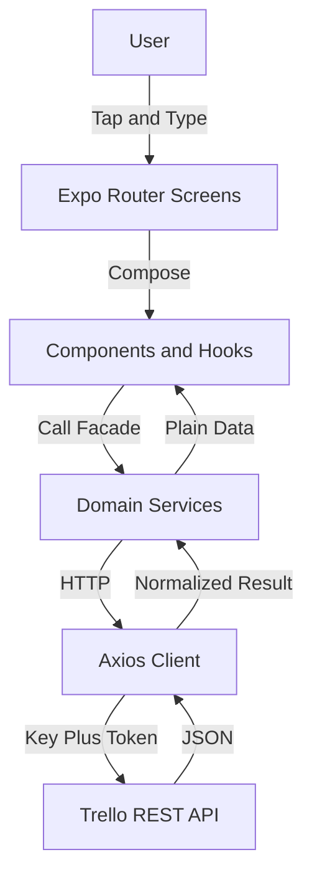

**Usage**: Reference in ARCHITECTURE.md.

## Data Flow Diagrams

**Purpose**: Request lifecycle from screen to Trello and back

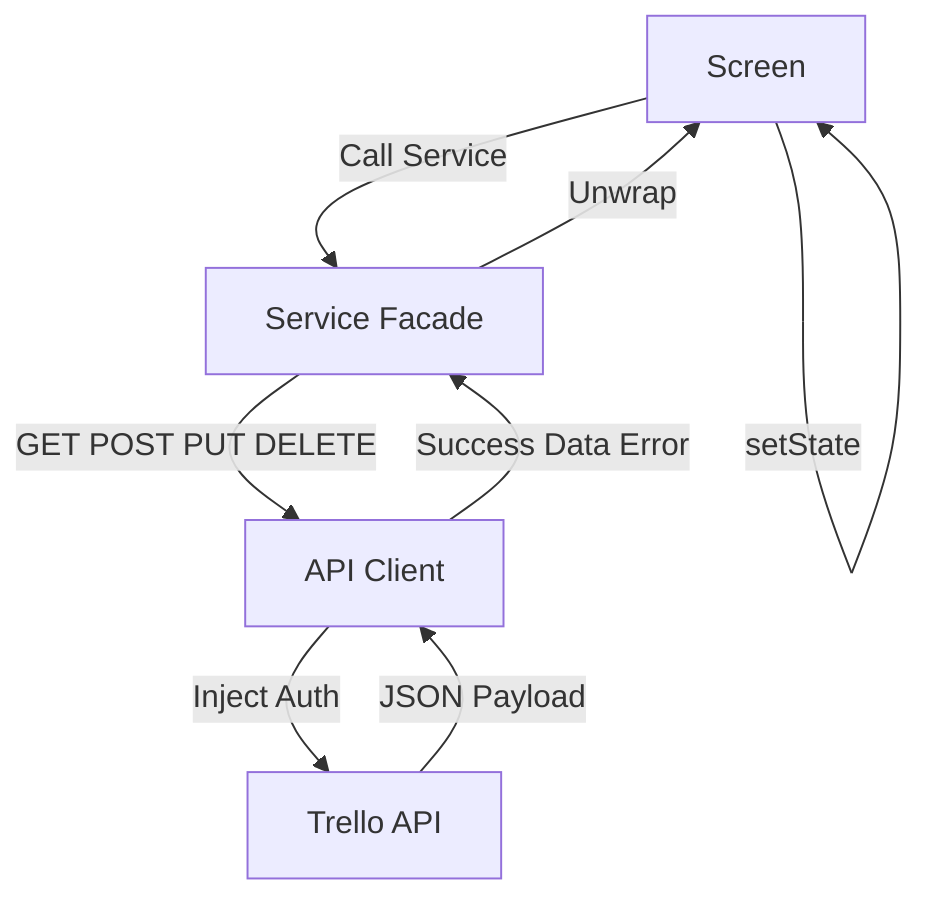

**Usage**: Reference in module DATA_FLOW.md files.

## Activity Diagrams

**Purpose**: Board loading with parallel fetches

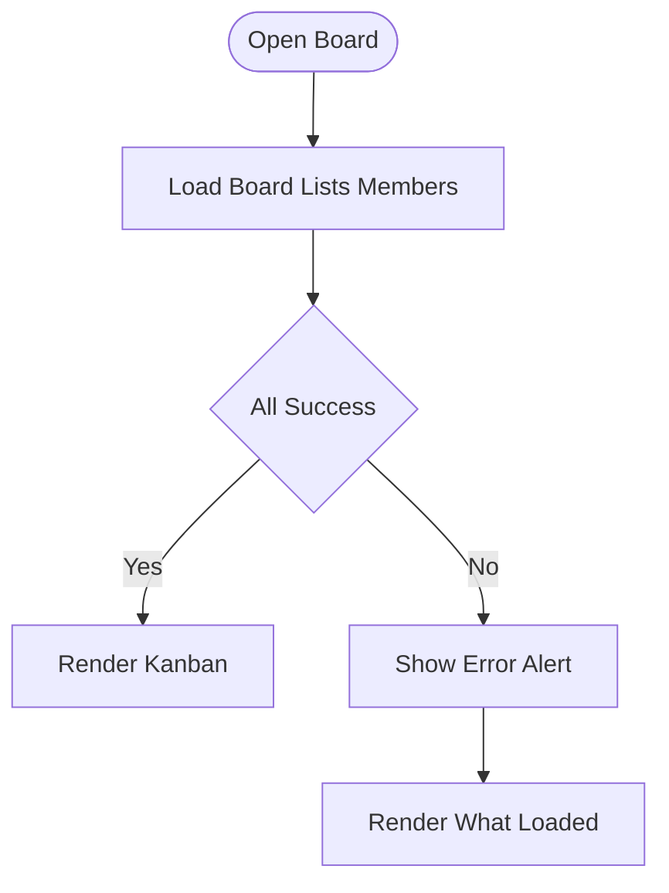

**Usage**: Reference in boards module docs.

## Use Case Diagrams

**Purpose**: Who does what across the app

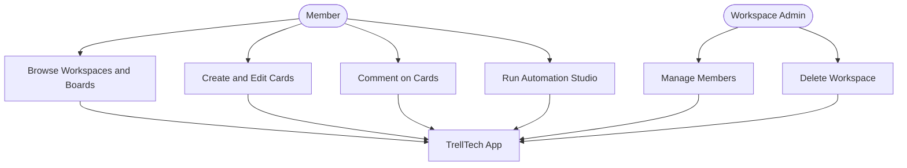

**Usage**: Reference in FEATURES.md.

## Sequence Diagrams

**Purpose**: Authenticated request flow

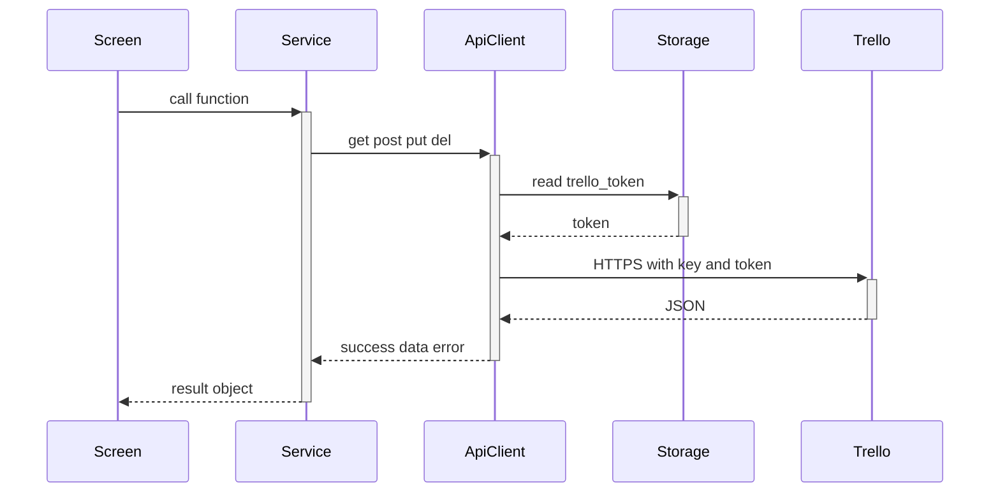

**Usage**: Reference in services and FUNCTIONS.md files.

## Interaction Diagrams

**Purpose**: Which services the automation touches

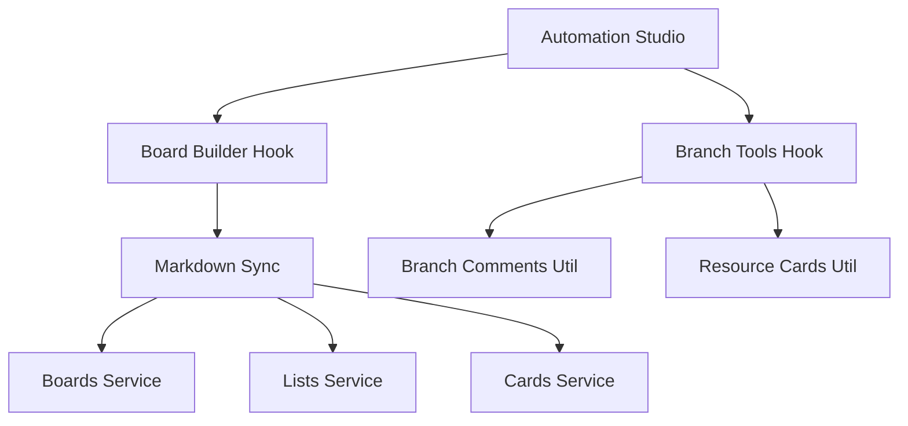

**Usage**: Reference in automation module docs.

## State Diagrams

**Purpose**: Card lifecycle on a board

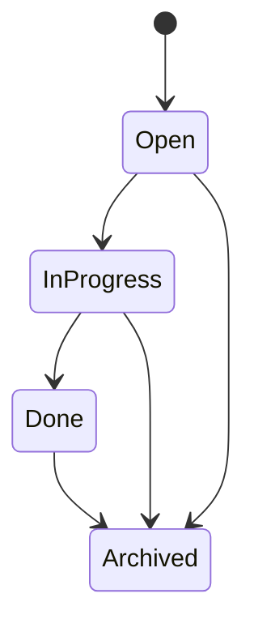

**Usage**: Reference in cards and lists module docs.

## Entity Relationship Diagrams

**Purpose**: Trello domain model (full version in DATABASE.md)

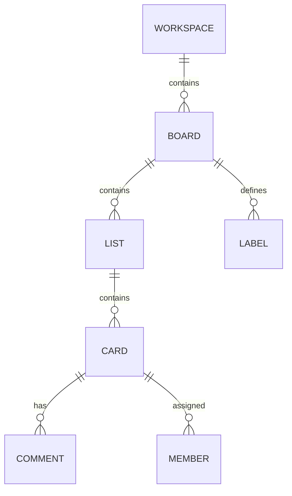

**Usage**: Reference in DATABASE.md.

## Page Hierarchy Maps

**Purpose**: Navigation from splash to card detail

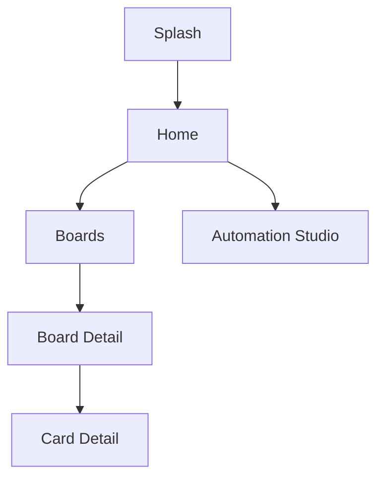

**Usage**: Reference in PAGE_LISTING.md.

## User Journey Maps

**Purpose**: First-run to productive use

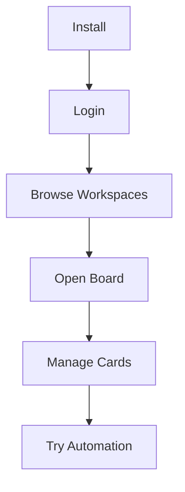

**Usage**: Reference in FEATURES.md and user guides.

## Deployment Diagrams

**Purpose**: From commit to store (full version in DEPLOYMENT.md)

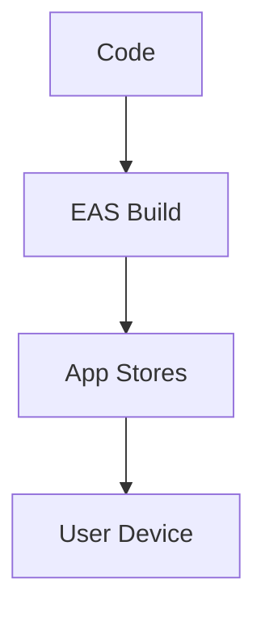

**Usage**: Reference in DEPLOYMENT.md.

### Module Diagrams

- [Auth Module Diagrams](./modules/auth/DIAGRAMS.md)
- [Workspaces Module Diagrams](./modules/workspaces/DIAGRAMS.md)
- [Boards Module Diagrams](./modules/boards/DIAGRAMS.md)
- [Lists Module Diagrams](./modules/lists/DIAGRAMS.md)
- [Cards Module Diagrams](./modules/cards/DIAGRAMS.md)
- [Comments Module Diagrams](./modules/comments/DIAGRAMS.md)
- [Members Module Diagrams](./modules/members/DIAGRAMS.md)
- [Automation Module Diagrams](./modules/automation/DIAGRAMS.md)
