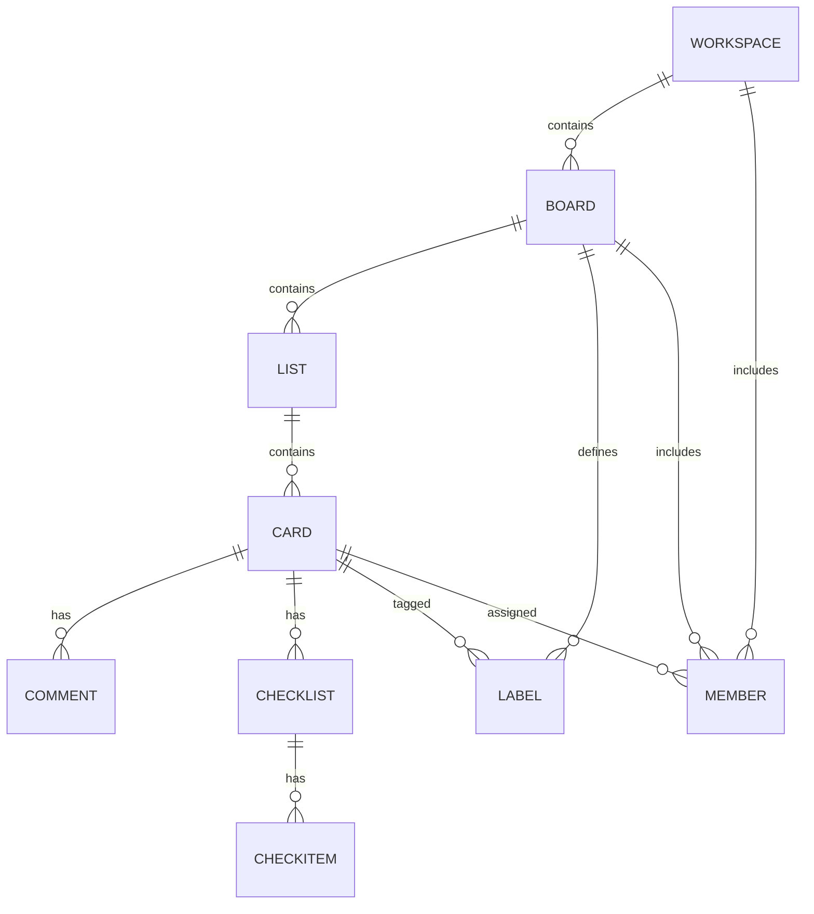

# Database

## Database Type

No local database. Trello is the system of record (remote REST resources). The app persists only two small keys in AsyncStorage: the Trello token and the onboarding flag.

## Entity Relationship Diagram

## Table Schemas

Remote Trello resources used by the app:

| Entity | Purpose | Key fields |
|--------|---------|------------|
| Organization | A workspace grouping boards | id, displayName, name, desc, websiteUrl |
| Board | A project surface | id, name, desc, idOrganization, prefs, closed, shortLink |
| List | A kanban column | id, name, pos, closed, idBoard |
| Card | A unit of work | id, name, desc, due, start, idList, idBoard, idMembers, idLabels, closed |
| Comment | A card discussion entry | id, idMemberCreator, data.text, date |
| Checklist | A named task group on a card | id, name, idCard |
| CheckItem | One checklist row | id, name, checked |
| Label | A colored tag defined per board | id, name, color |
| Member | A Trello user | id, fullName, username, avatarUrl, initials |

Local AsyncStorage keys:

| Key | Purpose | Type |
|-----|---------|------|
| trello_token | Trello OAuth token injected by the API client | string |
| hasSeenOnboarding | Whether the onboarding flow was completed | boolean |

## Indexes and Constraints

There are no local indexes because there is no local database. Performance relies on Trello-side filtering (`fields`, `filter=commentCard`, `limit`) and client-side throttling plus retry helpers in `utils/trello` to respect API rate limits.
