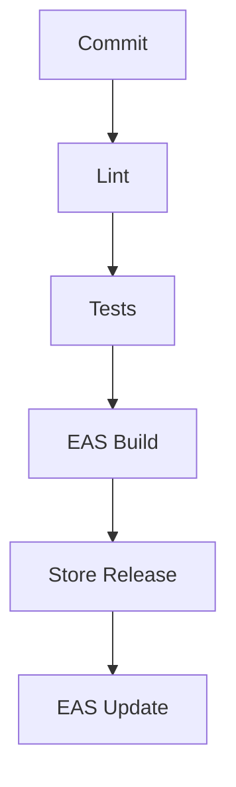

# Deployment

## Deployment Platforms

- Expo Go for quick testing
- EAS Build for Android APK/AAB and iOS IPA
- EAS Update for over-the-air JavaScript updates
- Web export via `expo start --web` for demos only

## Pre-Deployment Checklist

- [ ] Production Trello API key configured
- [ ] OAuth callback matches the release scheme
- [ ] `npm run lint` passes with zero problems
- [ ] `npm test -- --ci` passes 23 of 23
- [ ] Splash, icon, and app name reviewed

## Deployment Steps

```bash
npm install -g eas-cli
eas login
eas build:configure
eas build --platform android
eas build --platform ios
```

For OTA fixes between store releases:

```bash
eas update --branch production --message "Describe the fix"
```

## Deployment Pipeline



## Post-Deployment

- Smoke test login, workspace list, board detail, and card comments on a real device
- Confirm 401 handling still logs the user out cleanly
- Monitor Trello API rate-limit errors in logs

## Rollback Procedure

- For store builds: release the previous build artifact again
- For OTA updates: run `eas update` with the last known good bundle, or roll back the branch in the EAS dashboard
