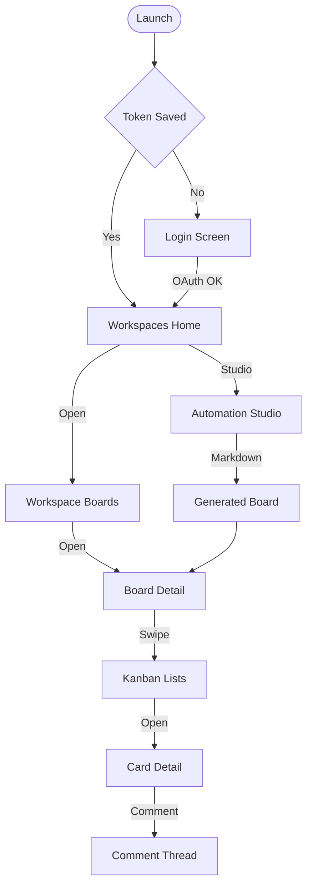
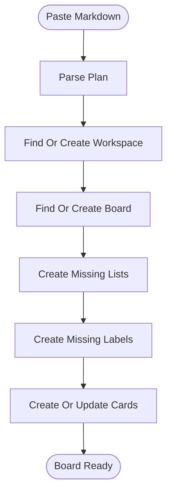

# Features

## Feature Overview

| Category | Features |
|----------|----------|
| Auth | Trello OAuth login, persistent session, logout, profile view |
| Workspaces | List, create, edit, delete workspaces, manage workspace members |
| Boards | List, search, sort, create from template, edit, archive |
| Lists and Cards | Kanban columns, create and edit lists and cards |
| Card Detail | Title, description, due date, members, archive |
| Comments | Add, edit, delete card comments |
| Automation | Markdown board builder, branch comments, resource cards, emoji cleanup |

## Feature Details

| Feature | Description | Status |
|---------|-------------|--------|
| OAuth login | Opens Trello authorization in a browser session, stores the token, and restores the session on launch. | [Implemented] |
| Workspace management | Create, rename, describe, and delete organizations, plus add and remove members by email. | [Implemented] |
| Board browsing | Search boards by name, description, and member, sort ascending or descending, pull to refresh. | [Implemented] |
| Board templates | New boards can start blank or with a preset list layout. | [Implemented] |
| Kanban view | Swipeable per-list columns with cards, plus inline card creation. | [Implemented] |
| Card detail | Edit name, description, and dates, manage members, archive the card. | [Implemented] |
| Comments | Full comment thread with add, inline edit, and delete. | [Implemented] |
| Markdown board builder | Paste or upload a board plan and generate organization, lists, labels, cards, checklists, and assignments. | [Implemented] |
| Branch tools | Add branch-name comments to every card, refresh them, or strip legacy emoji prefixes. | [Implemented] |
| Resource cards | Inject reference cards such as commit conventions into a Resources list. | [Implemented] |
| Workspace settings screen | Dedicated settings route exists as a stub. | [Planned] |

## Main User Journey

## Automation Journey

