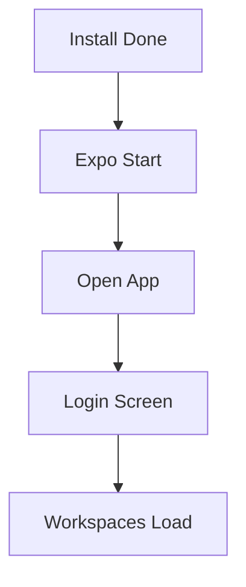

# Installation

## Prerequisites

- Node.js 18 or newer
- npm 9 or newer
- Expo Go app or an Android emulator / iOS simulator
- A Trello API key (from the Trello developer portal)

## Installation Steps

1. Clone the repository and enter the folder.
2. Run `npm install`.
3. Create a `.env` file with the Trello values below.
4. Run `npx expo start`.
5. Open the app in Expo Go, an emulator, or a simulator.
6. Log in with Trello when prompted.

## Environment Setup

```bash
EXPO_PUBLIC_APP_NAME=Trelltech
EXPO_PUBLIC_API_BASE_URL=https://api.trello.com/1
EXPO_PUBLIC_TRELLTECH_API_KEY=your_key_here
EXPO_PUBLIC_TRELLTECH_API_SECRET=your_secret_here
EXPO_PUBLIC_OAUTH_CALLBACK=trelltech://oauth
EXPO_PUBLIC_SCOPES=read,write
```

The API key identifies the app to Trello. The token obtained at login is stored on-device and injected into every request automatically.

## Verification



You are done when the login screen appears, OAuth returns a token, and the workspace list loads.

## Troubleshooting

| Problem | Fix |
|---------|-----|
| Metro bundler errors | Stop Expo, run `npx expo start -c` to clear cache |
| OAuth never returns | Check `EXPO_PUBLIC_OAUTH_CALLBACK` matches the app scheme |
| 401 on every call | Log out and back in to refresh the stored token |
| Native build issues | Use Expo Go or EAS Build instead of bare native builds |
