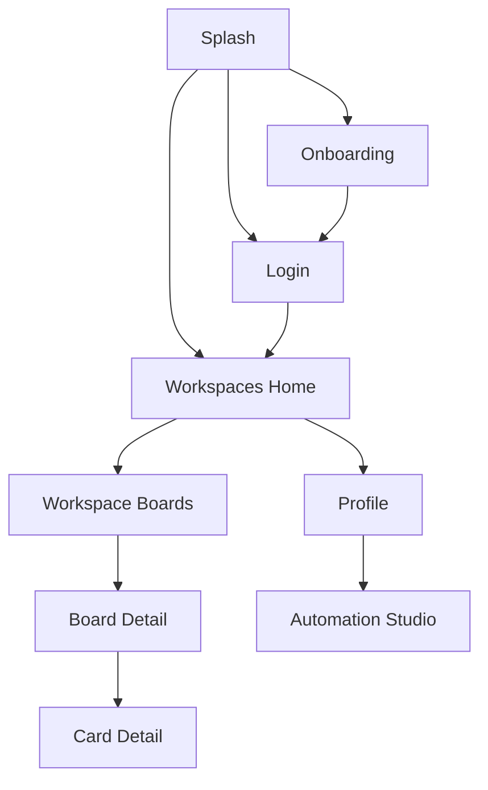
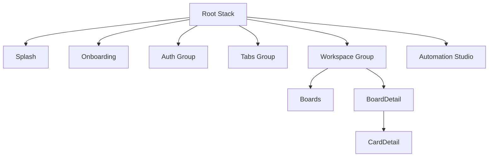

# Page Listing

## Route Structure Overview

## Page Inventory

| Route | Page Name | Description | Auth Required | Roles | Key Components |
|-------|-----------|-------------|---------------|-------|----------------|
| `/` | Splash | Animated splash that redirects by session state | No | All | AuthContext |
| `/onboarding` | Onboarding | First-run intro slides | No | All | Slides |
| `/(auth)/login` | Login | Starts Trello OAuth flow | No | Guest | AuthContext |
| `/(tabs)/home` | Workspaces Home | Lists workspaces with refresh | Yes | User | WorkspaceList, WorkspaceAccordion |
| `/(tabs)/profile` | Profile | Shows user info and links to Studio | Yes | User | BottomDrawer |
| `/workspace/[workspaceId]/boards` | Workspace Boards | Searchable sortable board list | Yes | User | BoardsList, BoardCard, CreateBoardDrawer |
| `/workspace/[workspaceId]/settings` | Workspace Settings | Settings placeholder screen | Yes | User | Stub |
| `/workspace/[workspaceId]/board/[boardId]` | Board Detail | Kanban columns with drawers | Yes | User | ListCarousel, KanbanView, drawers |
| `/workspace/[workspaceId]/board/[boardId]/card/[cardId]` | Card Detail | Card info, members, dates, comments | Yes | User | CardDetails, CardComments |
| `/create-board` | Automation Studio | Markdown builder plus branch tools | Yes | User | useBoardBuilder, useBranchTools, LiveTimeline |

## Page Hierarchy

## Protected vs Public Routes

Public: splash, onboarding, login. Everything else requires a stored Trello token. Unauthenticated access redirects to login, and a 401 from the API clears the session.
