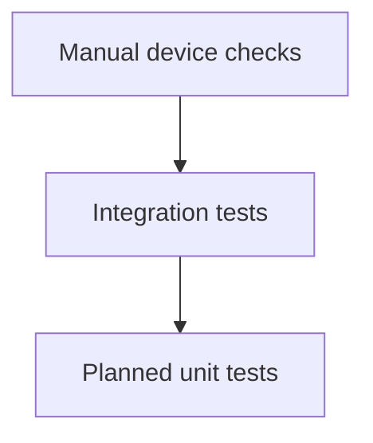
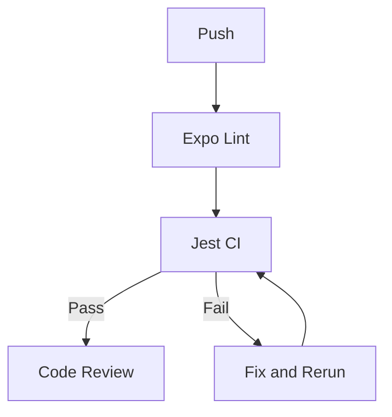

# Testing Strategy

The suite focuses on integration coverage of the highest-risk flows: authentication and board detail loading. Unit coverage of services and the markdown parser is the next gap to close.

## Testing Pyramid



Two integration suites exist today and cover login plus board detail rendering. Planned service and parser unit tests would form the base of the pyramid.

## Test Coverage Goals

| Layer | Target | Today |
|-------|--------|-------|
| Services (`services`) | 80 percent | No dedicated tests yet |
| Markdown parser (`utils/markdown`) | 80 percent | No dedicated tests yet |
| Validators (`lib/validation`) | 100 percent | No dedicated tests yet |
| Screens (integration) | Critical paths | Auth and BoardDetail covered |

## Testing Tools

- Jest 29 with jest-expo presets
- React Native Testing Library and jest-native matchers
- react-test-renderer for component trees

## Running Tests

```bash
npm test -- --ci        # run once, CI mode
npm run test:watch      # watch mode during development
npm run test:coverage   # coverage report
```

Expected output: 2 suites, 23 tests, all passing, 0 snapshots.

## CI and Test Workflow


