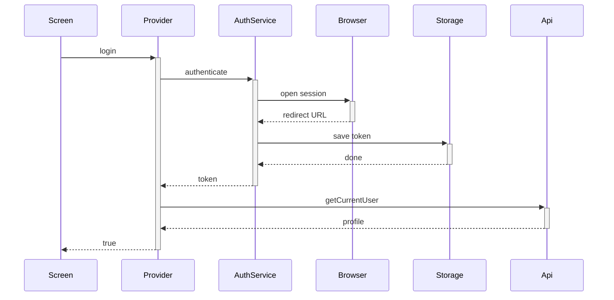

# Auth Call Chains

## Complex functions list

- `authenticate()` — browser session, URL parsing, token extraction, storage write
- `checkAuth()` — startup restore with failure cleanup
- `login()` — chains three async steps where each depends on the last

## Call chain per function

- `login()` calls `authenticate()` to open Trello and get a token
- Then it calls storage save to persist the token
- Then it calls `getCurrentUser()` to load the profile
- Then it sets state so the app navigates home
- `checkAuth()` reads storage, then calls `getCurrentUser()`, then either sets state or clears storage and state

## Why the chain exists

Trello uses token auth with no refresh flow, so the app must keep the token itself and prove it is still valid by fetching the profile. Every step can fail independently, so the chain validates as it goes instead of trusting a stored string.

## Edge cases and error paths

- User cancels the browser flow: `authenticate` throws, `login` returns false, no state changes
- Token expired or revoked: profile fetch fails, token is removed, user lands on login
- Network down at launch: treated like an invalid session, user can retry from login

