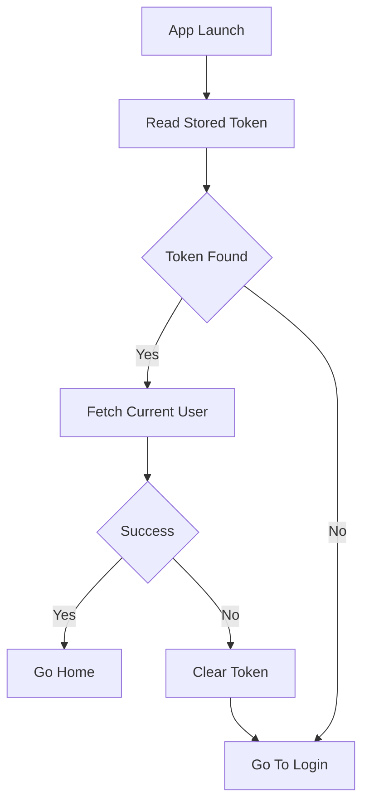
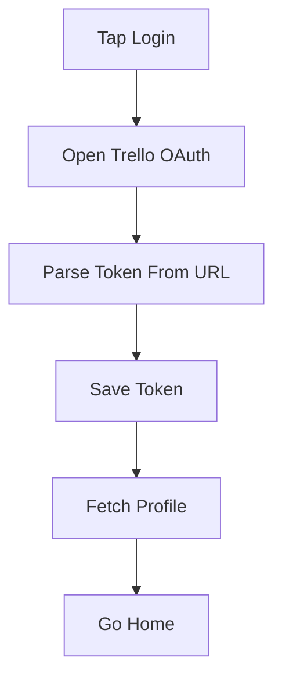

# Auth Data Flow

## Inputs

- Saved token from AsyncStorage at launch
- OAuth result URL carrying a fresh token after browser login
- Trello profile JSON from `GET members/me`

## Transformations

Login runs the browser session, parses the token from the redirect URL, saves it, then fetches the profile. At launch the provider reads the stored token first and only then fetches the profile. Any fetch failure clears the token so a bad session never lingers.

## Outputs

- `AuthContext` value: user, token, isAuthenticated, login, logout
- Token persisted under `trello_token`
- Navigation: home when authenticated, login otherwise

## State changes

Only AsyncStorage changes: `trello_token` is written on login and removed on logout or auth failure. No Trello data is modified except profile updates from the profile screen.

