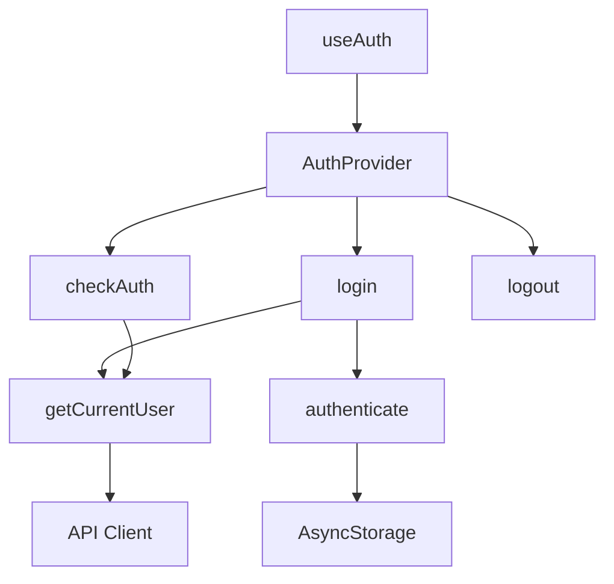

# Auth Functions

## Public API surface

- `authenticate()` returns a token string or throws when cancelled
- `getCurrentUser()` returns the Trello member object or throws
- `updateCurrentUser({fullName, bio})` updates the profile and returns it
- `useAuth()` exposes user, token, isAuthenticated, isLoading, login, logout, refetchUser

## Internal helpers

- `checkAuth()` inside the provider restores the session at startup
- `login()` chains authenticate, storage save, and profile fetch
- `logout()` removes the token and clears state

## Relationships

`login` calls `authenticate`, then storage save, then `getCurrentUser`. `checkAuth` calls storage read, then `getCurrentUser`, then either sets state or clears storage. Screens never call storage directly for auth.

## Data flow between functions

`authenticate` produces a token, storage keeps it, `getCurrentUser` turns it into a user object, and the provider fans both out to every screen through context.
