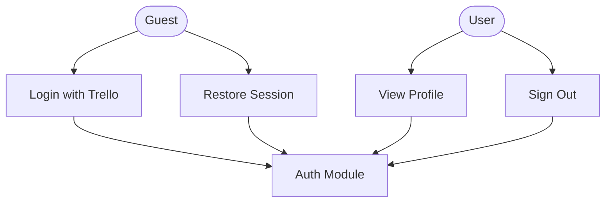
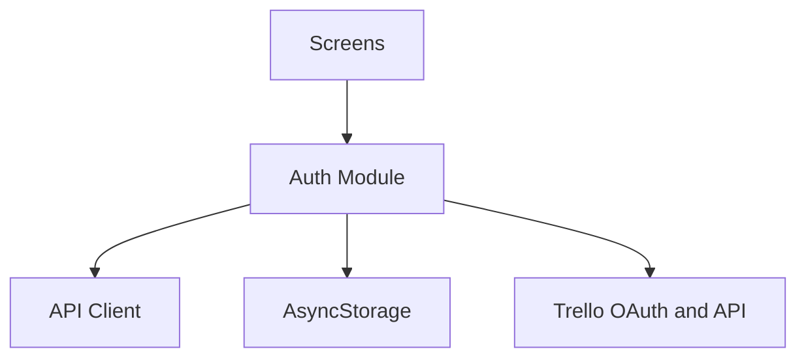

# Auth Module

## What this module is for

Think of this module as the bouncer at the door. It logs you in with Trello, remembers your token between launches, and kicks you out cleanly when you sign out or the token dies.

## Where it lives in the code

- `services/auth.js` — OAuth flow plus current-user fetch and update
- `contexts/AuthContext.jsx` — session state for the whole app
- `app/(auth)/login.jsx` — login screen, `app/index.jsx` — splash redirect

## Main characters

- `authenticate()` runs the Trello browser OAuth dance and saves the token.
- `getCurrentUser()` fetches your Trello profile through the API client.
- `AuthProvider` holds user, token, login, and logout, and restores the session at startup.
- `useAuth()` is how every screen reads the session.

## How it connects to other modules

Every other module depends on auth indirectly: the API client reads the stored token, so no screen passes tokens around. A 401-style failure in `checkAuth` clears the token and sends you back to login.

## The typical happy-path flow

You open the app, the splash finds a saved token, the provider loads your profile, and you land on the workspaces home. New users go through onboarding, then the login screen opens Trello in a browser, and the returned token is stored.

