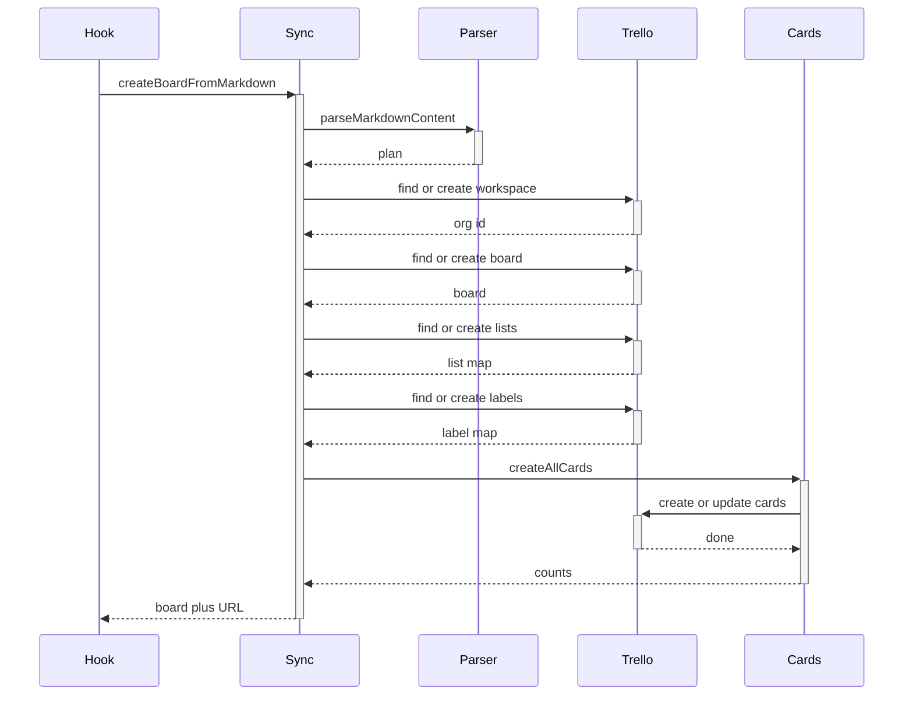
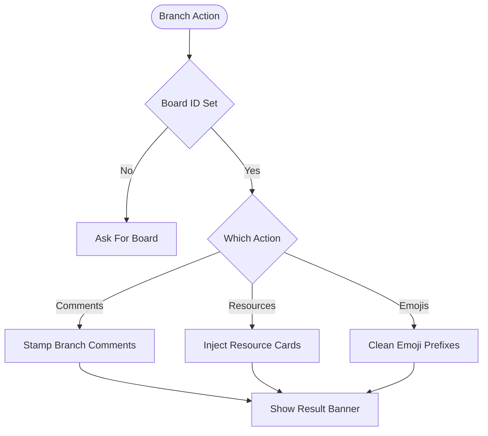

# Automation Call Chains

## Complex functions list

- `createBoardFromMarkdown` — six-stage orchestration with logging and one result object
- `createAllCards` — per-card loop with find, create-or-update, labels, assignee, checklist
- `parseMarkdownContent` — line state machine handling English plus French variants
- `addBranchCommentsToBoard` — throttled per-card comment stamping with skip and update flags
- `handleBranchAction` — action switch routing comments, resources, and emoji cleanup

## Call chain per function

- `createBoardFromMarkdown` validates the input string, then calls `parseMarkdownContent`
- Then it calls `findOrCreateOrganization` to get a workspace ID
- Then it calls `findOrCreateBoard` to get the board
- Then it calls `findOrCreateLists` to get the list ID map
- Then it calls `findOrCreateLabels` to get the label ID map
- Then it fetches workspace members and calls `createAllCards` with everything
- Then it returns board plus URL
- `createAllCards` resolves each card list ID, then finds an existing card by name
- Then it either updates description, labels, assignee, and checklist, or creates the card and applies all of them

## Why the chain exists

Trello exposes single-resource endpoints only, so a full board needs dozens of ordered calls with pauses between them. Find-first semantics make reruns safe: the same plan twice produces updates, not duplicates.

## Edge cases and error paths

- Non-string input throws before any network call
- Missing card list skips that card and counts it as skipped
- One failed card never stops the loop; per-card try-catch records and continues
- Aborted runs exit quietly through the shared abort flag

