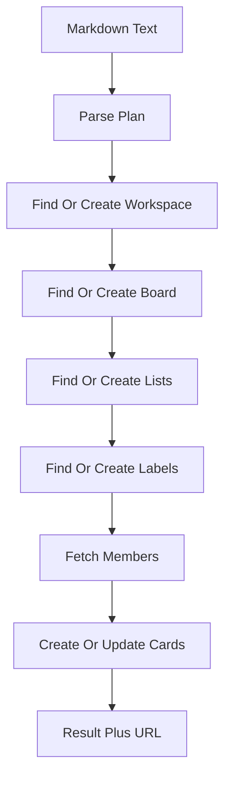
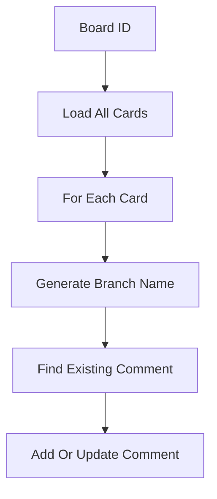

# Automation Data Flow

## Inputs

- Markdown text pasted, picked from a file, or copied from the clipboard
- Board ID plus action choice on the branch tab
- Workspace roster for assignee matching

## Transformations

The parser walks markdown lines into organization, board, lists, labels, and cards with checklists and acceptance criteria. Labels map emoji or French color hints to Trello colors. Card descriptions merge body text with acceptance criteria. Existing boards, lists, labels, and cards are found first so reruns update instead of duplicating.

## Outputs

- Created or updated Trello workspace, board, lists, labels, cards, checklists
- Branch comments stamped or cleaned on every card
- Live log entries plus a final result banner with counts and board URL

## State changes

Trello gains the full board structure on build, comment edits on branch runs, and two reference cards on resource runs. Locally the hooks track loading, results, uploaded file info, and the log array.

