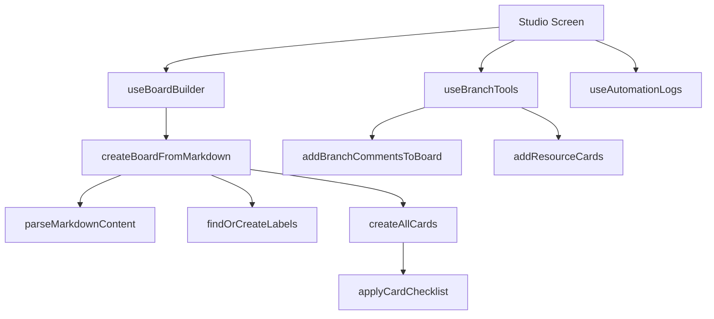

# Automation Functions

## Public API surface

- `createBoardFromMarkdown(content)` returns board plus URL or an error
- `deleteMarkdownLabelsFromBoard(content)` removes plan labels from a board
- `addBranchCommentsToBoard(boardId, skipWeek1, updateExisting)` with per-card counts
- `removeEmojisFromComments(boardId)` normalizes legacy comments
- `addResourceCards(boardId)` injects the two reference cards
- Hooks: `useAutomationLogs`, `useBoardBuilder`, `useBranchTools`

## Internal helpers

- `parseMarkdownContent` plus `stripMarkdown` for plan parsing
- `findOrCreateLabels`, `createLabel`, `addLabelToCard` for tags
- `applyCardChecklist`, `updateCardChecklist` for task lists
- `generateBranchName` for conventional branch strings
- `withRetry`, `sleep`, `createThrottler` for rate-limit safety

## Relationships

The screen owns tabs and animations while hooks own state and service calls. Sync orchestrates parse then find-or-create steps then card processing. Branch and resource utils reuse the card and comment services directly.

## Data flow between functions

Parse produces the plan, find-or-create steps produce ID maps for lists and labels, and card processing consumes those maps plus the member roster to create or update each card.
