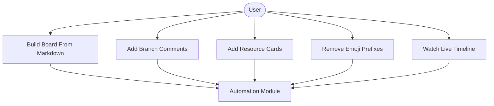
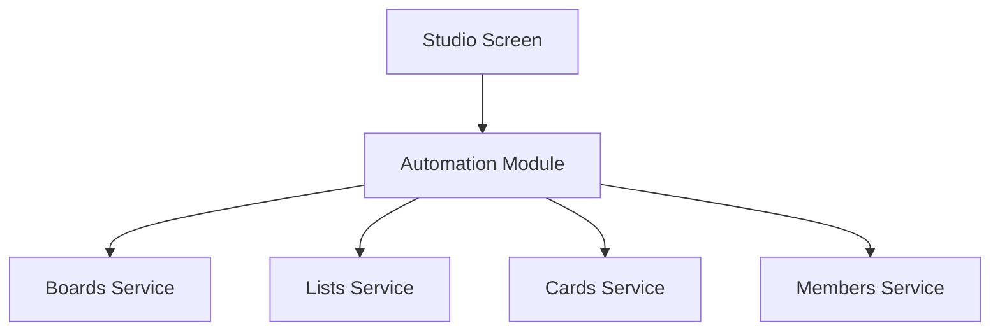

# Automation Module

## What this module is for

Think of this as your Trello robot assistant. You paste a project plan written in markdown, and it builds the whole board for you: workspace, lists, labels, cards, checklists, and assignments. It can also stamp branch names onto cards and inject reference cards.

## Where it lives in the code

- `app/create-board.jsx` — the Studio screen with builder and branch tabs
- `hooks/useBoardBuilder.js`, `hooks/useBranchTools.js`, `hooks/useAutomationLogs.js`
- `utils/boardFromMarkdown.js` plus `utils/markdown/` — parse, labels, checklists, cards, sync
- `utils/addBranchComments.js`, `utils/addResourceCards.js`, `utils/branchNames.js`
- `components/automation/` — action button, result banner, live timeline

## Main characters

- `parseMarkdownContent()` turns your markdown into a board plan object.
- `createBoardFromMarkdown()` runs the whole build: workspace, board, lists, labels, cards.
- `createAllCards()` creates or updates every card with labels, assignees, and checklists.
- `useBoardBuilder` owns paste, upload, and build state while `useBranchTools` owns board discovery plus branch actions.

## How it connects to other modules

It is the biggest customer of boards, lists, cards, and members: every build step calls those services. Logs stream into the timeline component so you can watch the robot work.

## The typical happy-path flow

You paste markdown or upload a file, hit build, watch the timeline fill with progress, and get a result banner with the board link. Then you switch to the branch tab to stamp branch comments on every card.

