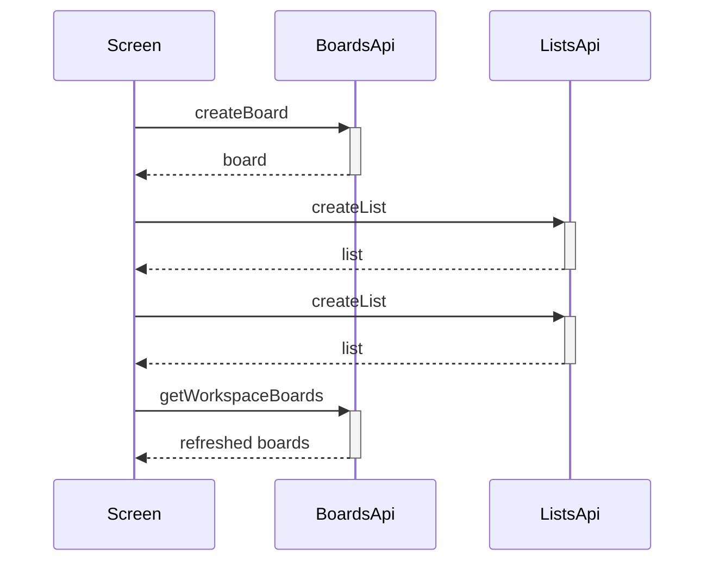

# Boards Call Chains

## Complex functions list

- `handleCreateBoard` — validation, board creation, template lists, reload
- `loadBoardData` — parallel board, lists, and members fetch with combined error handling
- `filteredBoards` memo — index, filter, and sort in one pass

## Call chain per function

- `handleCreateBoard` validates the name with the shared `required` helper
- Then it calls `createBoard` with trimmed name and description
- Then it looks up the template and creates each starter list in order
- Then it clears the form, closes the drawer, and reloads boards
- `loadBoardData` fires board, lists, and members requests together, then sets each piece of state that succeeded

## Why the chain exists

Trello has no create-board-with-lists endpoint, so templates are emulated client-side. Parallel loading keeps board detail fast, and per-piece state updates let partial data still render.

## Edge cases and error paths

- Blank board name stops before any network call
- Template with no lists skips list creation cleanly
- Any failed parallel fetch shows one error alert while keeping whatever loaded

