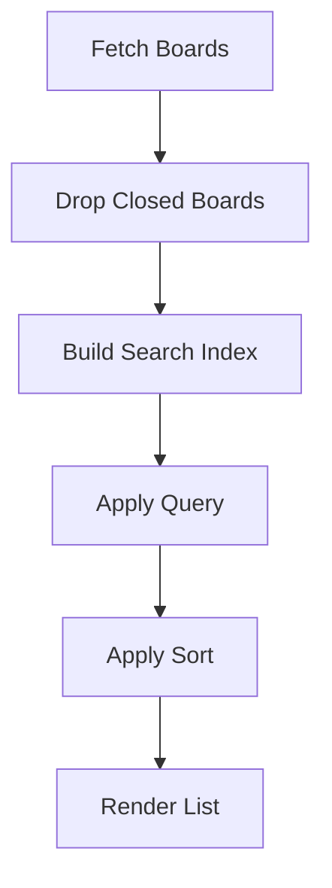
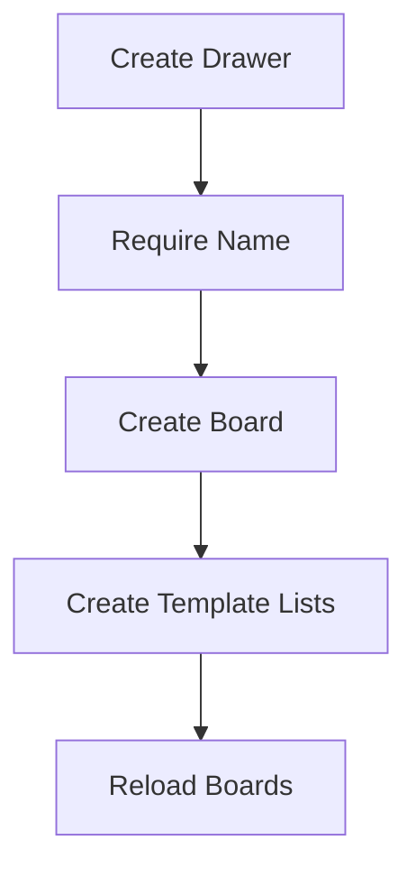

# Boards Data Flow

## Inputs

- Workspace ID from navigation params
- Search query and sort direction from local UI state
- New board name, description, and template choice from the drawer

## Transformations

Fetched boards are filtered to exclude closed ones. Search matches against a lowercase index of name, description, and member names. Sorting uses locale comparison, flipped by the sort toggle. Creation trims inputs and skips empty names before calling the API.

## Outputs

- Filtered sorted board arrays for the list
- New board plus its template lists
- Error alerts when fetch or creation fails

## State changes

Trello gains new boards and lists, or marks boards closed on archive. Locally the screen resets the drawer form and reloads the list after every mutation.

