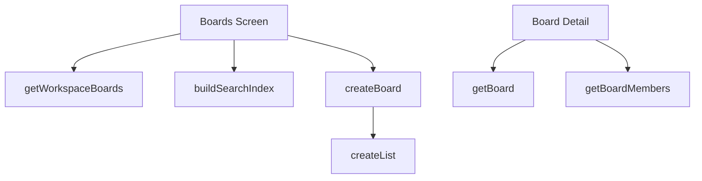

# Boards Functions

## Public API surface

- `getWorkspaceBoards(workspaceId)` with fixed field selection
- `getBoard(boardId)` including membership info
- `createBoard(workspaceId, {name, description, background})`
- `updateBoardName`, `updateBoardDescription`, `updateBoardBackground`
- `archiveBoard(boardId)` which closes rather than deletes
- `getBoardMembers(boardId)`

## Internal helpers

- `buildSearchIndex(board)` flattens name, description, and members for search
- `filteredBoards` memo combines query filter plus locale sort
- `getTemplateById(template)` supplies starter lists for new boards

## Relationships

The screen fetches through `getWorkspaceBoards`, memoizes the visible list, and creates through `createBoard` plus `createList` per template entry. Board detail reuses `getBoard` and `getBoardMembers` for its header.

## Data flow between functions

`getWorkspaceBoards` feeds raw boards, `buildSearchIndex` feeds the filter, the memo feeds the list, and `createBoard` plus template lists feed the reload that refreshes everything.
