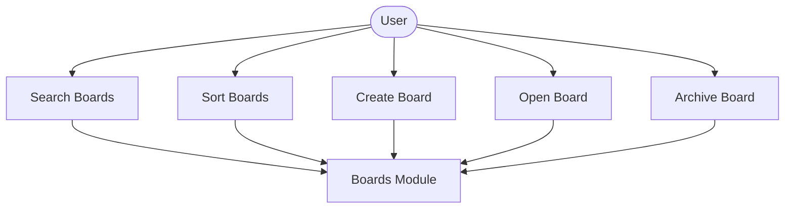
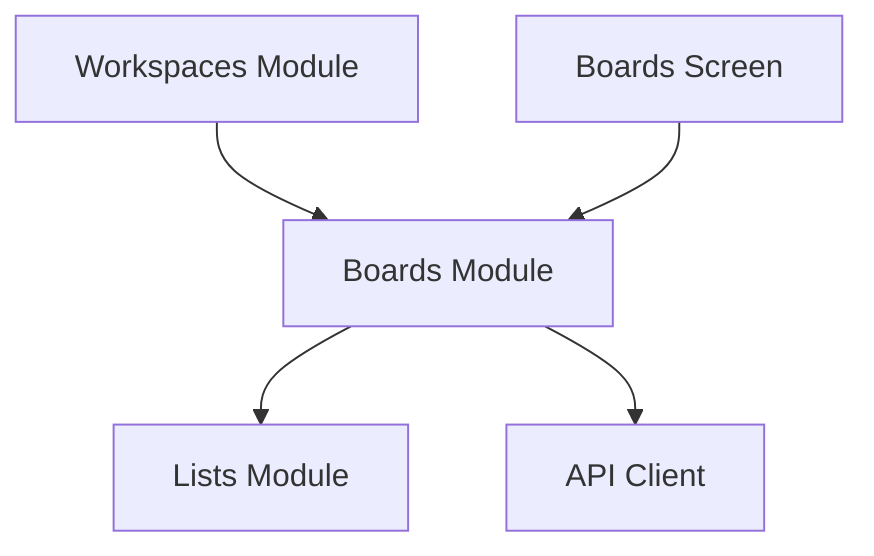

# Boards Module

## What this module is for

Boards are where projects live. This module lists them with search and sort, creates them from templates, renames them, and archives them when they are done.

## Where it lives in the code

- `services/boards.js` — board CRUD plus board members
- `app/workspace/[workspaceId]/boards.jsx` — searchable board list screen
- `components/boards/` — header, list, card, create drawer, empty state

## Main characters

- `getWorkspaceBoards()` loads open boards for a workspace.
- `createBoard()` creates a board, then the screen adds template lists.
- `BoardsList` handles search input, sort toggle, and pull to refresh.
- `BoardCard` shows color strip, name, description, and member avatars.

## How it connects to other modules

It receives a workspace ID from the workspaces module and hands board IDs to the lists module. Template list creation calls into the lists service directly.

## The typical happy-path flow

You open a workspace, type to filter or flip the sort, tap a board to enter it, or open the create drawer, pick a template, and watch the new board appear after its starter lists are created.

