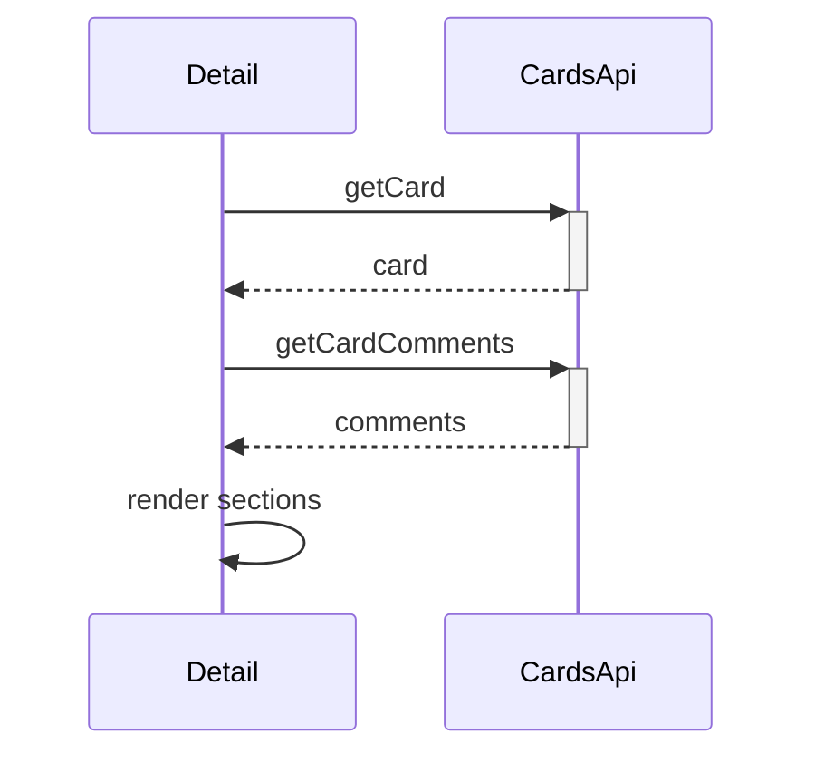

# Cards Call Chains

## Complex functions list

- `fetchData` in CardDetail — card plus comments with early exit and shared loading flag
- `handleSaveCardUpdate` — content update, conditional date update, refresh, drawer close
- Archive handler — confirm dialog, delete, conditional navigation

## Call chain per function

- `fetchData` returns early without a card ID, then sets loading
- Then it calls `getCard` and stops with an alert when it fails
- Then it calls `getCardComments` and defaults to an empty thread on failure
- Then it clears loading in all cases
- `handleSaveCardUpdate` validates the name, then calls `updateCard`, then calls `updateCardDates` only when a date changed, then refreshes and closes

## Why the chain exists

Card detail combines three concerns — content, schedule, and discussion — that live on different endpoints. Dates are split into their own call because Trello treats null as clear and the UI must distinguish keep, change, and remove.

## Edge cases and error paths

- Blank card name stops before the network
- Failed content update skips the date update entirely
- Archive failure keeps the card open with an error alert

