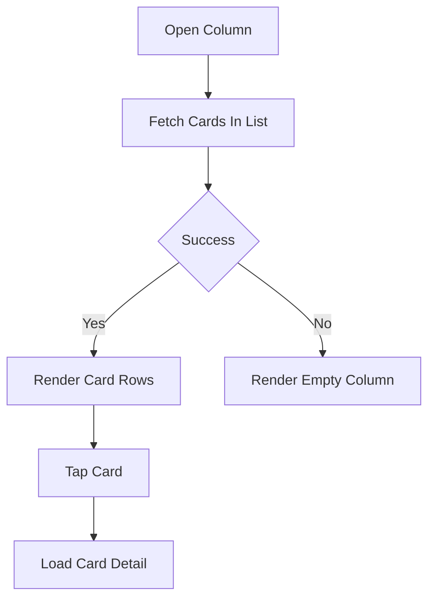
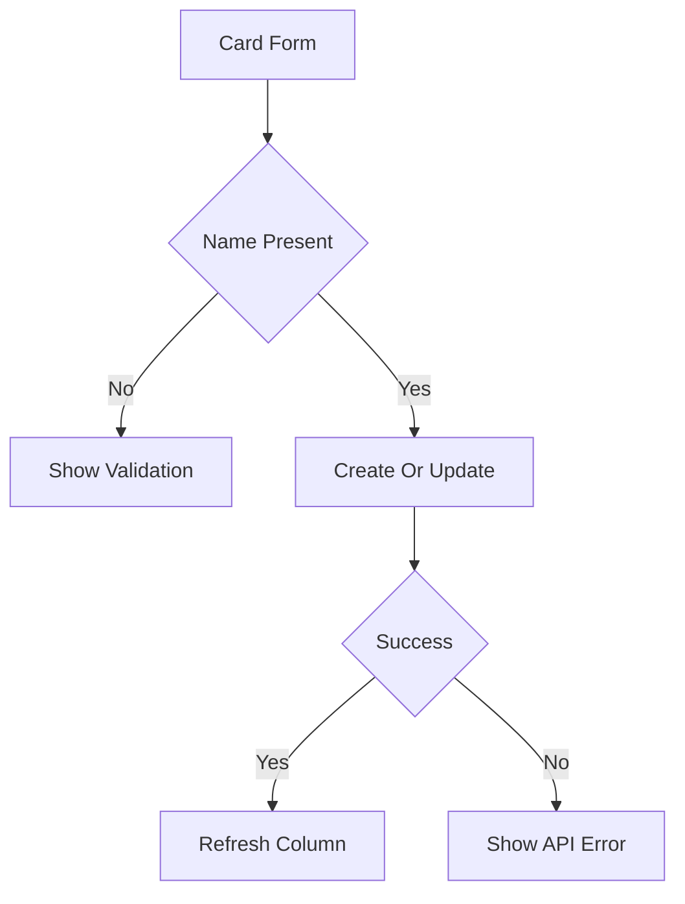
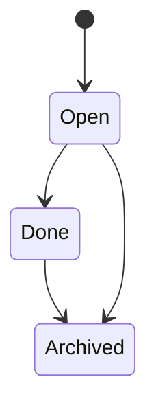

# Cards Data Flow

## Inputs

- List ID for column loading and card creation
- Card ID from the detail route
- Name, description, start and due dates from forms
- Member IDs for assignment

## Transformations

Names are required and trimmed. Description accepts empty text. Dates are stored as ISO strings and cleared by sending null. Member arrays become comma-separated Trello parameters. Failed loads reset lists to empty arrays so `.map` never crashes.

## Outputs

- Card arrays per column and single-card detail objects
- Drawer close plus data refresh after mutations
- Alerts for load, create, update, and archive failures

## State changes

Trello gains new cards, updates fields and dates, or removes cards on archive. Local drawers reset their inputs after success.

## Card lifecycle

