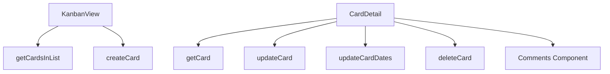

# Cards Functions

## Public API surface

- `getCardsInList(listId)` and `getCard(cardId)` for reads
- `createCard(listId, {name, description, due, start, idMembers})`
- `updateCard(cardId, {name, description, due, start, idList, closed})`
- `updateCardDates(cardId, start, due)` where null clears a date
- `deleteCard(cardId)` used by the archive flow

## Internal helpers

- `fetchData` in CardDetail loads card plus comments together
- `handleSaveCardUpdate` chains content update then date update then refresh
- `buildCardDescription` in automation merges description with acceptance criteria

## Relationships

`KanbanView` loads per-column cards and creates new ones inline. `CardDetail` loads one card, delegates discussion to the comments component, membership to the members drawer, and editing to the update drawer.

## Data flow between functions

List fetches fill columns, selection picks one card ID, detail fetch fills the screen, edits flow through update functions, and refresh re-runs the detail fetch.
