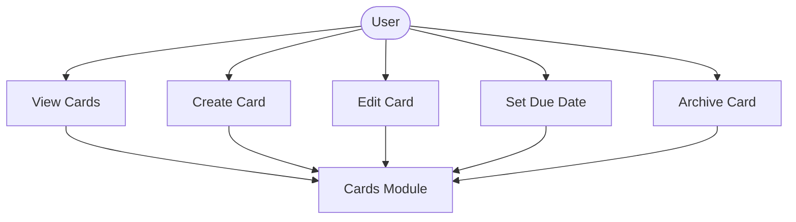
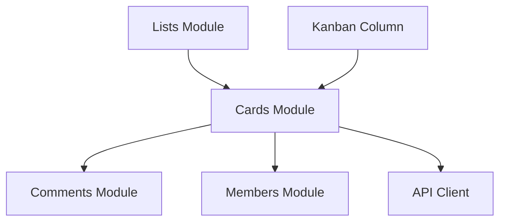

# Cards Module

## What this module is for

Cards are the actual tasks. This module shows them inside kanban columns, creates new ones, edits their details and dates, and archives them when finished.

## Where it lives in the code

- `services/cards.js` — card CRUD, dates, and comment endpoints
- `components/Kanban.jsx` — column content with inline card creation
- `components/TaskCard.jsx` — tappable card row
- `components/cards/CardDetails.jsx`, `CardUpdate.jsx`, `DateSelectionDrawer.jsx`

## Main characters

- `getCardsInList()` loads the cards for one column.
- `createCard()` adds a card with optional description, dates, and members.
- `updateCard()` and `updateCardDates()` edit content and schedule.
- `CardDetail` composes title, members, description, dates, actions, and comments.

## How it connects to other modules

Lists supply the column IDs, comments attach discussion to each card, and members supply assignees. Tapping a card row navigates to the card detail route.

## The typical happy-path flow

A kanban column loads its cards, you add one through the bottom drawer, tap it to open the detail, edit its fields or dates, and archive it when done.

