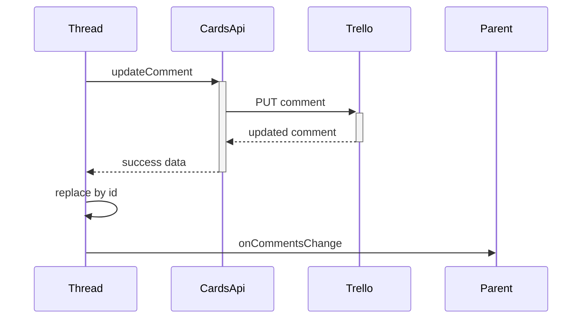

# Comments Call Chains

## Complex functions list

- `saveEdit` — replace one comment after an in-place update
- `handleAddComment` — post with loading flag and parent sync
- `handleDelete` — remove with filtered refresh

## Call chain per function

- `saveEdit` ignores blank drafts, then calls `updateComment` with card, comment, and text
- Then it maps the old array, swapping only the matching ID for the returned comment
- Then it refreshes parent and child and exits edit mode
- `handleAddComment` posts trimmed text, appends the returned comment, clears the input, and notifies the parent

## Why the chain exists

In-place update keeps authorship and timestamps intact, unlike the old delete-plus-repost trick. Parent sync matters because the detail screen also owns a copy of the thread.

## Edge cases and error paths

- Blank text never reaches the network
- Failed update keeps edit mode open with an alert
- Failed delete leaves the thread unchanged

