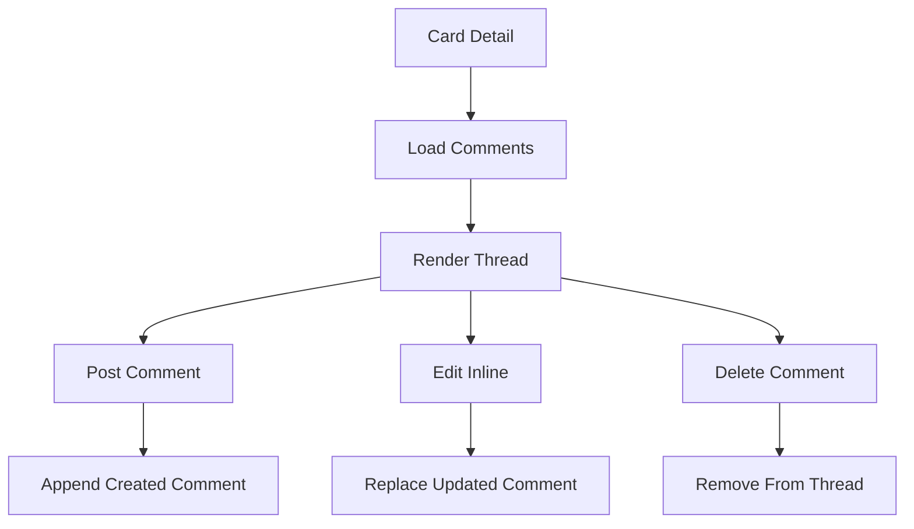

# Comments Data Flow

## Inputs

- Card ID from the detail route
- Initial comment array from the parent
- New or edited text from inputs

## Transformations

Text is trimmed and empty submissions are ignored. Edits update one comment in place instead of the old delete-plus-repost approach. Deletes filter the removed ID out of the thread.

## Outputs

- Thread arrays rendered with author, text, and date
- Parent notified through `onCommentsChange` on every mutation
- Error alerts naming the failed comment action

## State changes

Trello gains, edits, or removes comment actions. Local editing state tracks which comment is being edited plus the draft text.

