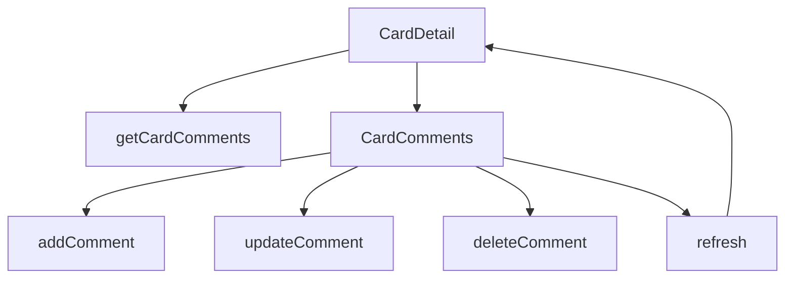

# Comments Functions

## Public API surface

- `getCardComments(cardId)` filtered to comment actions only
- `addComment(cardId, text)` requiring non-blank text
- `updateComment(cardId, commentId, text)` for in-place edits
- `deleteComment(cardId, commentId)` for removal

## Internal helpers

- `refresh(updated)` sets local state and notifies the parent
- `startEditing` and `cancelEditing` manage the inline draft
- `saveEdit` and `handleDelete` wrap the service calls

## Relationships

Card detail loads the thread once and passes it down. The comments component owns all later mutations and pushes each new array back up so the parent never goes stale.

## Data flow between functions

Load fills the thread, user actions call one mutation function, the returned comment replaces or joins the array, and refresh syncs parent and child together.
