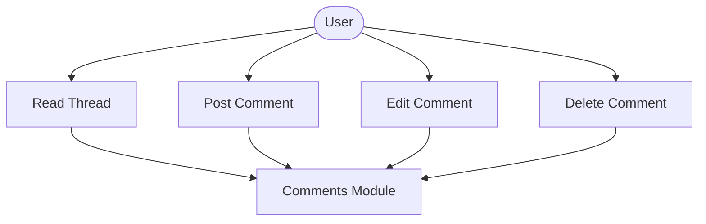
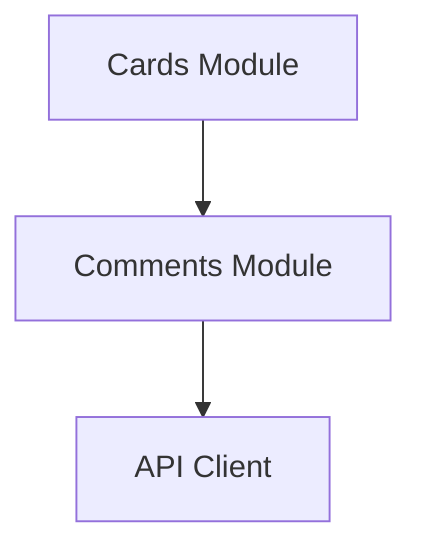

# Comments Module

## What this module is for

Comments are the conversation on a card. This module lists the thread, posts new messages, edits them inline, and deletes them.

## Where it lives in the code

- `services/cards.js` — `getCardComments`, `addComment`, `updateComment`, `deleteComment`
- `components/cards/CardComments.jsx` — thread UI with inline editing
- `components/cards/CardDetails.jsx` — hosts the thread and passes the initial list

## Main characters

- `getCardComments()` loads only comment actions for a card.
- `addComment()` posts trimmed text and returns the created comment.
- `updateComment()` edits a comment in place.
- `CardComments` keeps the thread state and notifies the parent on every change.

## How it connects to other modules

It is always hosted by the cards module, which supplies the card ID and the initial thread. It never touches other modules directly.

## The typical happy-path flow

Card detail loads and hands the thread down. You type at the top and send, or tap edit on one message to change it inline, or delete it. Every change updates both the local thread and the parent.

