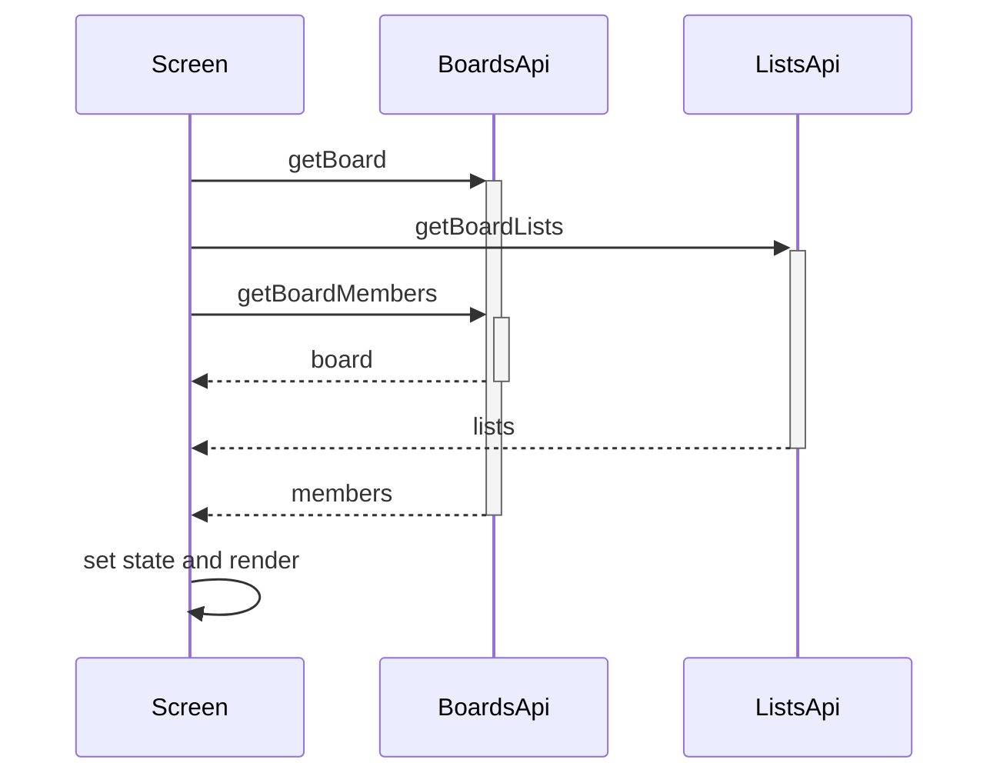

# Lists Call Chains

## Complex functions list

- `loadBoardData` — three parallel fetches with per-piece state and one combined alert
- `handleCreateList` — validate, create, reset, close, reload
- Carousel paging — scroll offset to index without fighting the user gesture

## Call chain per function

- `loadBoardData` fires `getBoard`, `getBoardLists`, and `getBoardMembers` together
- Then it sets board, lists, and members for every request that succeeded
- Then it shows a single error alert if anything failed
- `handleCreateList` validates the name, then calls `createList`, then clears the form, closes the drawer, and reloads

## Why the chain exists

One loading spinner covers three resources so the screen feels fast. Partial success still renders because each setter is independent, which matters on flaky mobile networks.

## Edge cases and error paths

- Missing board ID skips loading entirely
- Blank list name stops before the network
- Failed reload keeps the old columns visible with an alert

