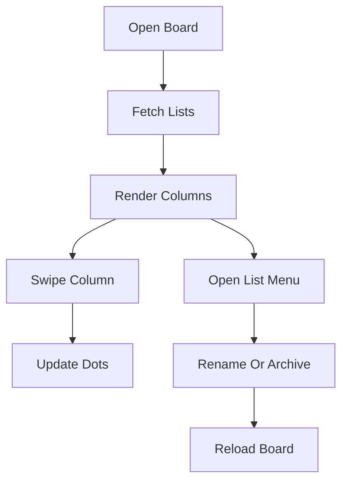
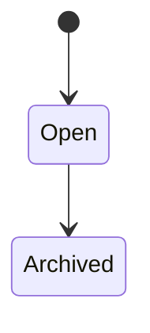

# Lists Data Flow

## Inputs

- Board ID from navigation params
- New or edited list name from drawer forms
- Carousel scroll offset for the current column index

## Transformations

Names are trimmed and rejected when blank. Update builds a payload with only the fields you changed. Archive is just an update that sets closed to true. The carousel converts horizontal scroll offset into a column index for the dots.

## Outputs

- List arrays rendered as swipeable columns
- Drawer close plus reload after every mutation
- Error alerts naming the failed operation

## State changes

Trello gains, renames, or closes lists. Locally the detail screen tracks the column index, drawer visibility, and the selected list for menu actions.

## List lifecycle

