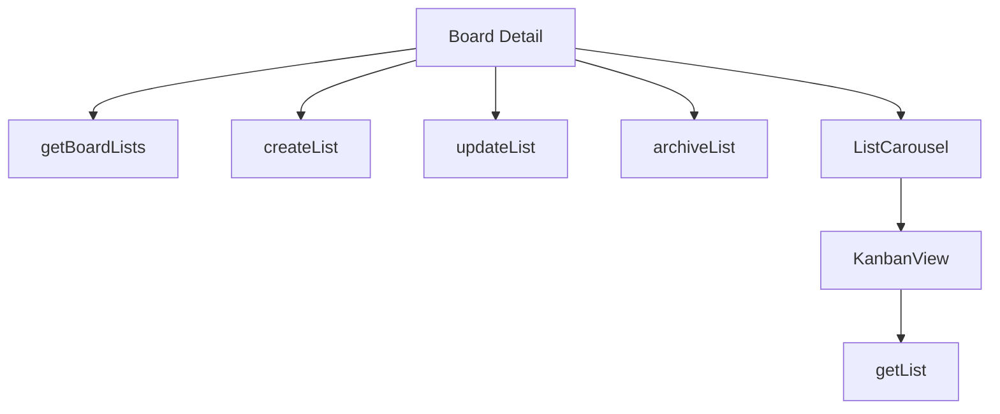

# Lists Functions

## Public API surface

- `getBoardLists(boardId)` with id, name, pos, and closed fields
- `getList(listId)` for a single column
- `createList(boardId, name, pos)` defaulting to the bottom
- `updateList(listId, {name, pos, closed})` sending only defined fields
- `archiveList(listId)` as a thin wrapper over update

## Internal helpers

- `loadBoardData` in board detail loads board, lists, and members in parallel
- `handleCreateList`, `handleUpdateList`, `handleArchiveList` wrap validation plus reload
- `ListCarousel` scroll handler converts offset to index

## Relationships

Board detail owns the list array and passes columns to the carousel, which renders one `KanbanView` per list. Drawers collect names and call back into the detail handlers. `KanbanView` also fetches its own list header through `getList`.

## Data flow between functions

`getBoardLists` fills the array, selection picks the active list, drawer forms supply names, mutation helpers persist, and reload refreshes the array for the carousel.
