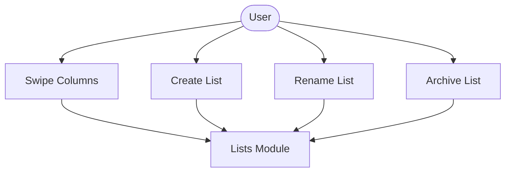
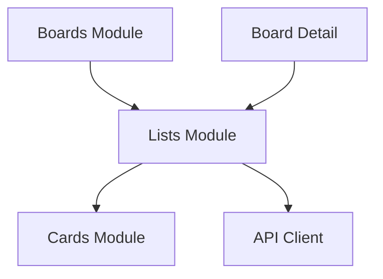

# Lists Module

## What this module is for

Lists are the kanban columns on a board. This module loads them, creates new ones, renames them, and archives the ones you no longer need.

## Where it lives in the code

- `services/lists.js` — list CRUD plus archive helper
- `app/workspace/[workspaceId]/board/[boardId]/index.jsx` — board detail orchestration
- `components/boardDetail/` — carousel, create, edit, and menu drawers
- `components/Kanban.jsx` — one swipeable column per list

## Main characters

- `getBoardLists()` loads the columns for a board.
- `createList()` adds a column at the bottom by default.
- `updateList()` renames or repositions a column.
- `ListCarousel` pages horizontally between columns with dot indicators.

## How it connects to other modules

Board detail feeds list IDs into the cards module, which loads cards per column. Board creation in the boards module also calls `createList` for template starter lists.

## The typical happy-path flow

Board detail loads board, lists, and members together. You swipe between columns, tap plus to add a list, or open a list menu to rename or archive it. Every change reloads the board data.

