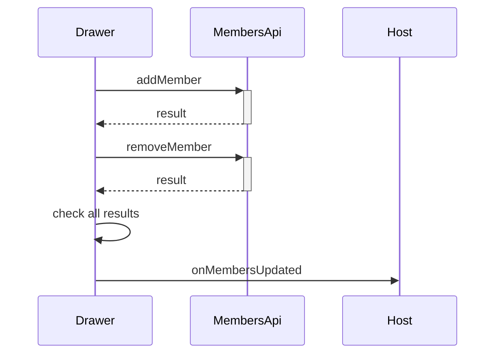

# Members Call Chains

## Complex functions list

- `handleDone` — diff plus two save batches with first-failure reporting
- `getAvailableMembers` card branch — card to board to board-members resolution
- `fetchMembers` — parallel load with independent failure tolerance

## Call chain per function

- `handleDone` filters selected IDs against current IDs into adds, and current against selected into removes
- Then it saves all adds and collects per-call results
- Then it saves all removes and collects results
- Then it shows the first error when any result failed, otherwise it refreshes and closes
- The card branch of `getAvailableMembers` fetches the card first for its board ID, then fetches that board roster

## Why the chain exists

One drawer handles three scopes, and Trello uses a different endpoint per scope. Batching both directions in one save keeps the picker feeling like a single action.

## Edge cases and error paths

- Empty diff saves nothing and just closes
- Partial failure keeps the drawer open with the first error named
- Failed load shows empty rosters instead of crashing maps

