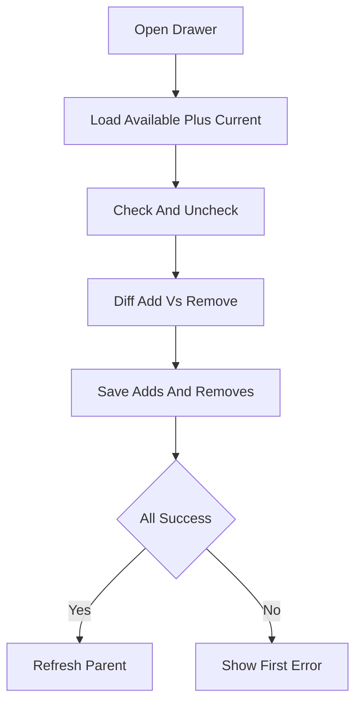

# Members Data Flow

## Inputs

- Scope (`workspace`, `board`, `card`) plus the instance ID
- Search query for filtering the roster
- Selected member ID set from checkboxes or avatars

## Transformations

The drawer loads available and current members in parallel, then diffs selected against current into an add list and a remove list. Search filters by full name or username in lowercase. Avatars hash the member key into a stable color.

## Outputs

- Avatar rows and counts across board headers and cards
- Added and removed memberships plus a parent refresh
- Error alert naming the first failed membership change

## State changes

Trello membership changes per scope: workspace invites, board joins, card assignments. Local selection resets every time the drawer opens.

