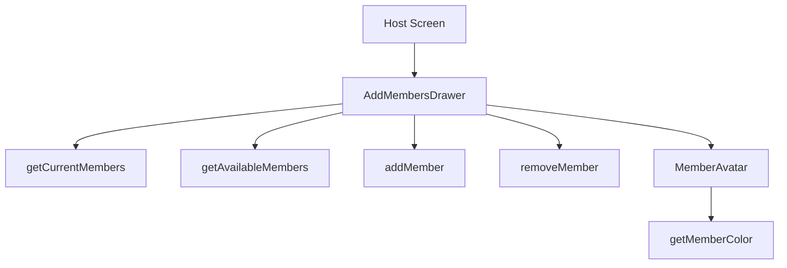

# Members Functions

## Public API surface

- `getCurrentMembers(scope, id)` for workspace, board, or card
- `getAvailableMembers(scope, id)` where card scope resolves through its board
- `addMember(scope, id, memberId)` with board PUT or card POST branches
- `removeMember(scope, id, memberId)` with board or card DELETE branches
- `getMemberColor(key)` and `getMemberInitials(name)` for avatars

## Internal helpers

- `fetchMembers` in the drawer loads both lists and builds ID sets
- `toggleMember` flips one ID in the selection set
- `handleDone` builds the two diffs and saves them

## Relationships

Host screens provide scope plus ID and a refresh callback. The drawer owns selection state and fans out to add and remove calls. Avatar helpers are pure and used everywhere members render.

## Data flow between functions

Load functions fill available plus current, toggle edits selection, diff splits selection into adds and removes, mutation functions persist both, and refresh reloads the host.
