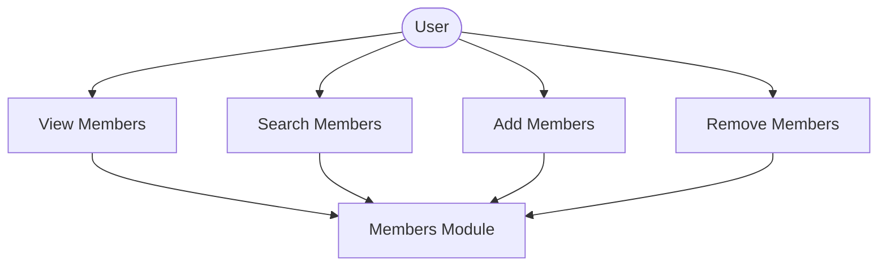
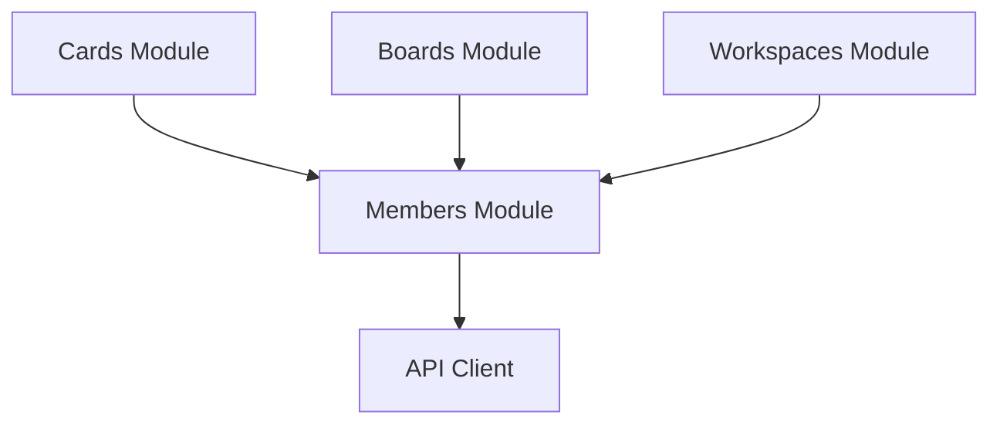

# Members Module

## What this module is for

Members are the people on your work. This module shows who is on a workspace, board, or card, and lets you add or remove them through a shared picker drawer.

## Where it lives in the code

- `services/members.js` — scope-based membership for workspace, board, and card
- `services/workspaces.js` — workspace invites by email
- `components/ui/AddMembersDrawer.jsx` — shared add and remove picker
- `components/ui/MemberAvatar.jsx` plus `utils/memberColors.js` — consistent avatars

## Main characters

- `getCurrentMembers(scope, id)` loads who is already there.
- `getAvailableMembers(scope, id)` loads who you could add.
- `addMember` and `removeMember` apply the diff per scope.
- `AddMembersDrawer` diffs current versus selected and saves both directions at once.

## How it connects to other modules

Workspaces invite by email, while boards and cards pick from existing workspace people. Cards, boards, and the workspace manager all host the same drawer with a different scope.

## The typical happy-path flow

You open the members drawer, search the roster, check or uncheck people, hit done, and the drawer adds the new ones plus removes the unchecked ones before refreshing the parent.

