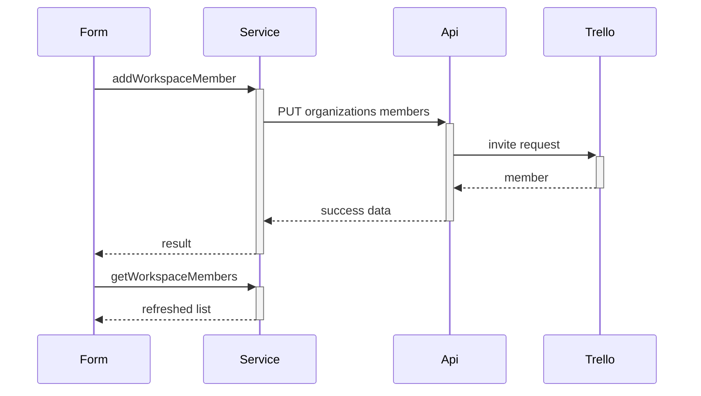

# Workspaces Call Chains

## Complex functions list

- `handleAddMember` in ManageWorkspaceMembers — validation, name derivation, invite, refresh
- `updateWorkspace` — partial payload building where only touched fields are sent
- Home `fetchWorkspaces` plus accordion member fetch — two-stage loading with mount guards

## Call chain per function

- `handleAddMember` trims and lowercases the email, then checks the format
- Then it derives a full name from the part before the at-sign
- Then it calls `addWorkspaceMember` with email, name, and normal type
- Then it reloads members and notifies the parent
- `updateWorkspace` picks each defined field, trims it, then sends one PUT

## Why the chain exists

Trello invites need both email and a display name, but users only type an email, so the form fills the gap. Partial updates avoid wiping fields the user never touched.

## Edge cases and error paths

- Empty or malformed email stops before any network call
- API rejection shows the server message and keeps the form open
- Unmounted accordion cancels member state updates safely

