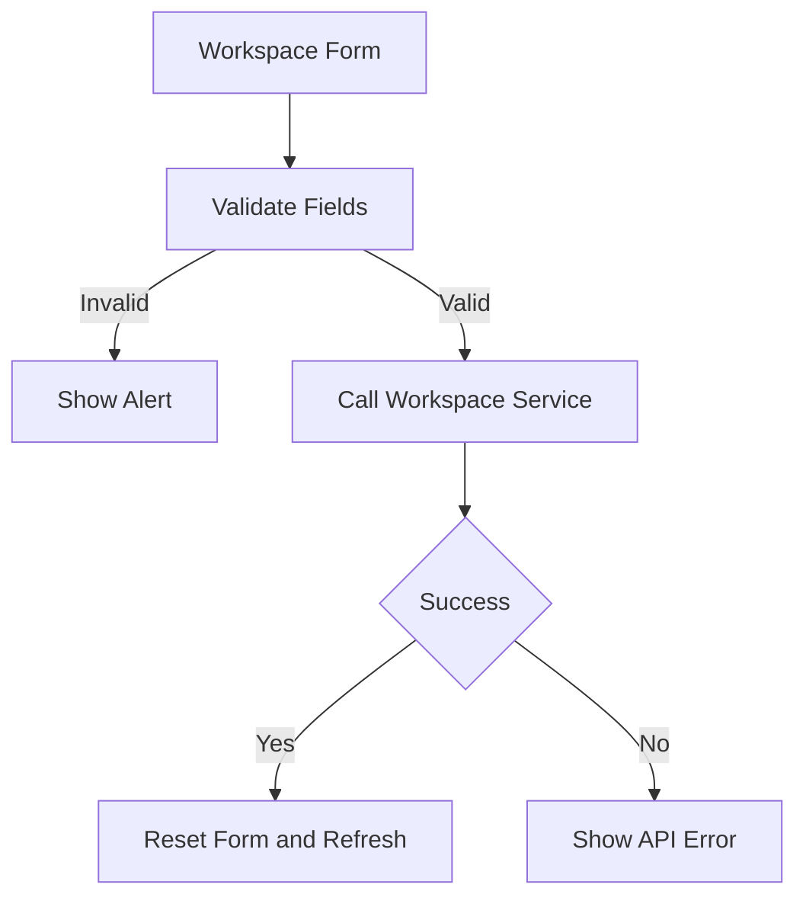
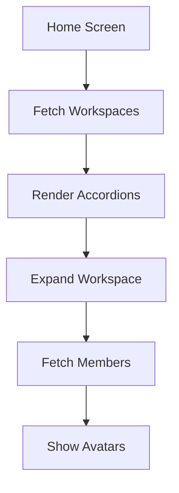

# Workspaces Data Flow

## Inputs

- Organization list from `GET members/me/organizations`
- Form fields: display name, short name, description, website
- Member email plus derived full name for invites

## Transformations

Forms validate locally with `lib/validation` before any call. Create trims and lowercases the short name. Update sends only the fields you touched. Member add derives a display name from the email local part when needed.

## Outputs

- Workspace arrays rendered as accordions
- Success and error alerts after create, update, delete, and invite actions
- Refresh callbacks that reload the home list

## State changes

All changes happen in Trello: organizations created, updated, or deleted, and members added or removed. Locally only form state resets after success.

