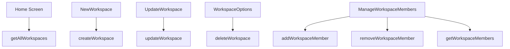

# Workspaces Functions

## Public API surface

- `getAllWorkspaces()`, `getWorkspace(id)`
- `createWorkspace({displayName, name, description, website})`
- `updateWorkspace(id, fields)` with partial updates
- `deleteWorkspace(id)`
- `getWorkspaceMembers(id)`, `addWorkspaceMember(id, {email, fullName})`, `removeWorkspaceMember(id, memberId)`
- Legacy aliases: `postWorkspace`, `deleteWorkspaceMember`, `deleteMember`, `addMember`

## Internal helpers

- `fetchWorkspaces` in home screen wraps loading state around `getAllWorkspaces`
- `fetchMembers` in ManageWorkspaceMembers normalizes the member array
- Email regex plus full-name derivation in the add-member form

## Relationships

Screens call the service functions and unwrap `{success, data}`. The options drawer coordinates edit, members, and delete drawers plus refresh. Member helpers delegate to the same organizations endpoints the list views read.

## Data flow between functions

`getAllWorkspaces` produces the list, selection picks one workspace, and every other function takes that ID plus form input. Mutation results flow back as refresh calls that re-run the list fetch.
