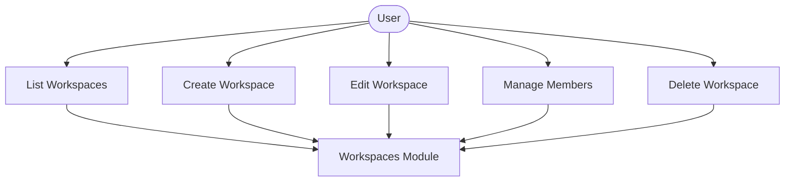
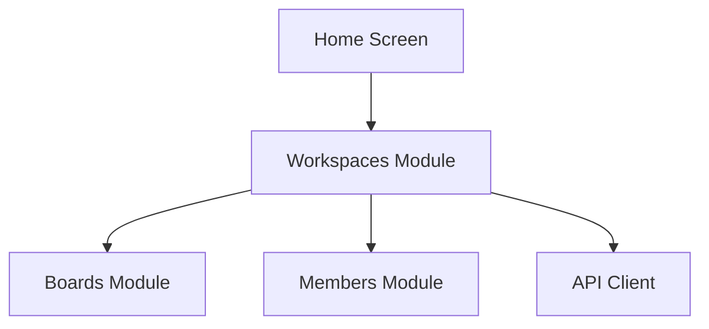

# Workspaces Module

## What this module is for

Workspaces are the top-level folders of your Trello life. This module lists them, lets you create and edit them, deletes them when asked, and manages who belongs to each one.

## Where it lives in the code

- `services/workspaces.js` — all organization API calls plus legacy aliases
- `app/(tabs)/home.jsx`, `components/home/` — list, accordion, options
- `components/workspace/` — NewWorkspace, UpdateWorkspace, ManageWorkspaceMembers forms

## Main characters

- `getAllWorkspaces()` loads your organizations for the home screen.
- `createWorkspace()` and `updateWorkspace()` power the create and edit drawers.
- `deleteWorkspace()` removes a workspace after confirmation.
- `WorkspaceAccordion` expands a workspace to show members and boards entry.

## How it connects to other modules

Home feeds workspace IDs into the boards module. The members module reuses workspace membership views. Auth supplies the token silently through the API client.

## The typical happy-path flow

Home loads your workspaces, you expand one to peek at members, then either jump into its boards or open the options drawer to edit, manage members, or delete.

