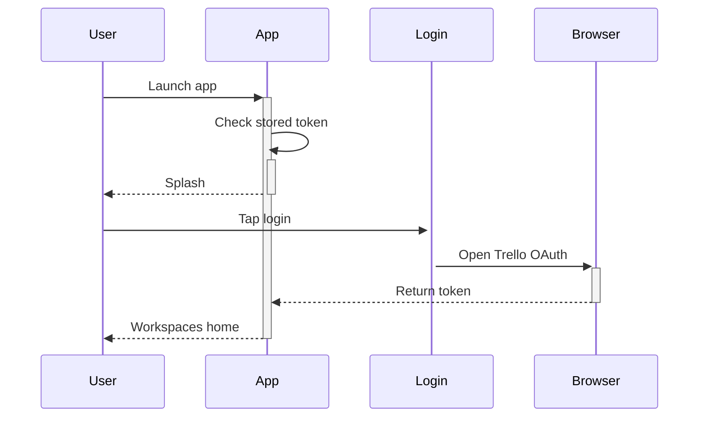

# Authentication Guide

## Overview

This guide walks you through logging in with Trello and managing your session. Trello handles the password part, so the app only keeps the resulting token.

## User Personas

- New users opening the app for the first time
- Returning users resuming a saved session

## UI Walkthrough - Step-by-Step

### Step 1: Open the app

**What to click**: Nothing yet, just launch the app icon on your device.

**What appears**: A dark splash screen with the TrellTech logo and tagline for about a second and a half.

**What happens next**: First-timers go to onboarding, returning users with a token jump straight to the workspaces home, and everyone else lands on login.

### Step 2: Log in with Trello

**What to click**: The login button in the center of the login screen.

**What appears**: Your system browser opens on the Trello authorization page asking you to allow Trelltech with read and write scope.

**What to enter/select**: Your Trello email and password inside the Trello page, then approve access.

**Visual feedback**: The browser closes itself and the app shows a brief loading state.

**What happens next**: You land on the workspaces home with your organizations listed.

### Step 3: Sign out

**What to click**: The avatar or profile tab, then the red "Sign Out" action card, then "Sign Out" again in the confirmation dialog.

**What appears**: A confirmation alert asking if you are sure.

**What happens next**: The token is deleted and you return to the login screen.

## Navigation Flow

## Expected Outcomes

Success looks like your workspace names loading on the home screen. A spinner that never ends usually means no network.

## Common Issues

- If the browser opens but never returns, reopen the app and tap login again.
- If every screen shows an auth error, sign out and back in to refresh the token.
