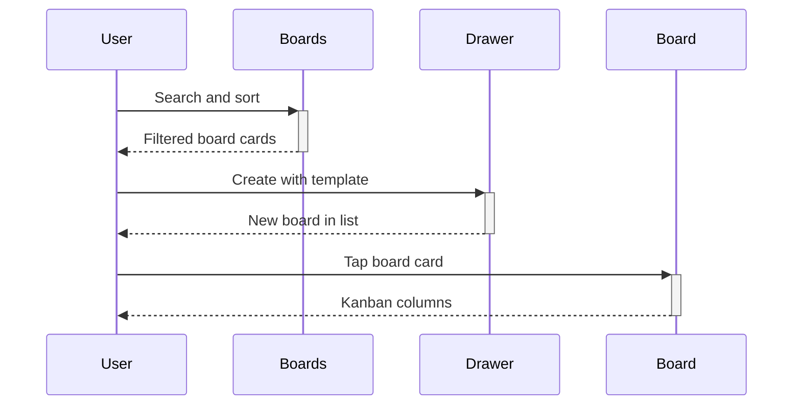

# Boards Guide

## Overview

Boards hold the kanban columns for one project. This guide covers finding, creating, opening, editing, and archiving boards.

## User Personas

- Team members working inside boards daily
- Leads creating boards from templates

## UI Walkthrough - Step-by-Step

### Step 1: Find a board

**What to click**: Open a workspace, then type in the "Search boards..." field at the top.

**What appears**: The list filters live by board name, description, and member names, with a count like "4 boards" below.

**What to enter/select**: Any fragment such as "mtn" works. Tap the X icon to clear.

**What happens next**: Tap the sort icon to flip between A to Z and Z to A.

### Step 2: Create a board

**What to click**: The plus button in the boards header.

**What appears**: A bottom sheet with Board Name, Description, and a Template picker showing each template plus its starter lists.

**What to enter/select**: Board Name is required. Expand the template picker and tap one template.

**Visual feedback**: The Create button shows a loading state while the board plus its lists are created.

**What happens next**: The sheet closes and the board appears in the list.

### Step 3: Work inside a board

**What to click**: Tap any board card to open it.

**What appears**: The board detail with a colored header, member bar, and swipeable list columns with dot indicators.

**What happens next**: Swipe sideways to move between lists, tap plus to add a list, or tap the menu dots for board actions.

### Step 4: Edit or archive

**What to click**: The three-dot menu in the board header, then "Edit Board Details" or "Archive Board".

**What appears**: An edit sheet with name and description, or a confirmation alert for archiving.

**What happens next**: Edits reload the header, archiving returns you to the boards list.

## Navigation Flow

## Expected Outcomes

Created boards show their template lists immediately. Archived boards vanish from the open list.

## Common Issues

- If Create stays disabled, the board name is empty.
- If a new board looks empty, its template had no starter lists.
