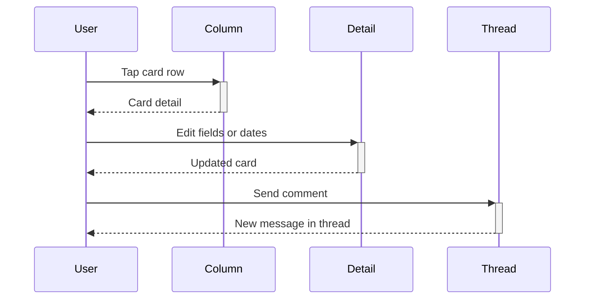

# Card Detail Guide

## Overview

Card detail is where single tasks live: title, description, members, due date, and the comment thread. This guide walks through all of it.

## User Personas

- Contributors updating task status and dates
- Reviewers following the discussion thread

## UI Walkthrough - Step-by-Step

### Step 1: Open a card

**What to click**: Tap any card row inside a kanban column.

**What appears**: The card detail screen with title card, members section, description, due date, Edit and Archive buttons, and the comments section below.

**What happens next**: Scroll down to reach the comment thread.

### Step 2: Edit the card

**What to click**: The blue "Edit" button, then change the name or description fields.

**What appears**: A bottom sheet with Card Name and Description inputs plus Cancel and Save.

**What to enter/select**: Card Name is required and cannot be blank.

**Visual feedback**: The Save button shows "Saving..." while the update runs.

**What happens next**: The sheet closes and the detail shows the new values.

### Step 3: Set a due date

**What to click**: The "Set" or "Change" pill in the due date section.

**What appears**: A date picker drawer with preset options and a remove option.

**What happens next**: The chosen date appears formatted in the due date section.

### Step 4: Manage members

**What to click**: The "Manage" pill in the members section.

**What appears**: The shared members drawer with search, current members checked, and the roster below.

**What happens next**: Confirming adds and removes assignments, then the member row refreshes.

### Step 5: Comment on the card

**What to click**: Type in the "Add a comment..." field at the top of the comments section, then tap "Send".

**What appears**: Your comment appears at the bottom of the thread with your name and timestamp.

**What to enter/select**: Any non-empty text. Tap Edit on your message for inline editing, Delete to remove it.

**What happens next**: The thread updates immediately for both you and anyone reloading the card.

## Navigation Flow

## Expected Outcomes

Edits persist after leaving and reopening the card. Comments show author, text, and time.

## Common Issues

- If Save does nothing, the card name is blank.
- If a comment never appears, check your network and retry.
