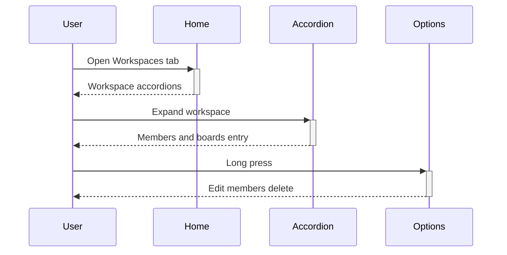

# Workspaces Guide

## Overview

Workspaces group your boards by team or topic. This guide covers browsing, creating, editing, deleting, and inviting members.

## User Personas

- Team members browsing their workspaces
- Workspace admins managing membership

## UI Walkthrough - Step-by-Step

### Step 1: Browse workspaces

**What to click**: The "Workspaces" tab at the bottom after login.

**What appears**: A dark list of workspace accordions with colored initial dots. Pull down to refresh.

**What happens next**: Tap an accordion to expand it and see members plus the button into its boards.

### Step 2: Create a workspace

**What to click**: The options button (three dots) in the header, then the create action.

**What appears**: A bottom sheet with Display Name, Short Name, Description, and Website fields.

**What to enter/select**: Display Name is required. Website must start with http or https when filled.

**Visual feedback**: The Save button shows "Saving..." while the request runs.

**What happens next**: The sheet closes and the new workspace appears in the list.

### Step 3: Manage members

**What to click**: Long-press a workspace accordion, then "Manage members".

**What appears**: A sheet with an email input, an Add button, and the current member list.

**What to enter/select**: Type a full email such as "teammate@example.com" and tap "Add".

**What happens next**: The member list refreshes with the new person included.

### Step 4: Delete a workspace

**What to click**: Long-press a workspace, then the red "Delete the workspace" button, then confirm.

**What appears**: A confirmation alert warning the action cannot be undone.

**What happens next**: The workspace disappears from the list.

## Navigation Flow

## Expected Outcomes

New and edited workspaces show up after the list refreshes. Invited members appear with their avatars.

## Common Issues

- If the Save button stays disabled, the required name field is empty.
- If an invite fails, double-check the email spelling and your network.
